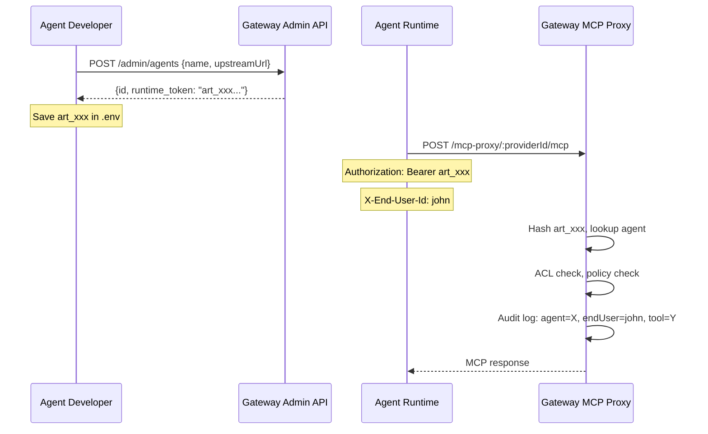

# Agent Runtime Token (art_xxx)

## Design Analysis

### Current auth model

```
gk_xxx  = General-purpose API key for third-party webapp servers
JWT     = User identity (end-users and admins)
```

Agent runtimes currently must use `gk_xxx` + `X-Agent-Id` + `X-User-Id` headers. This conflates "third-party server credential" with "agent runtime credential".

### Proposed auth model

```
gk_xxx  = Third-party webapp server-to-server auth (unchanged)
art_xxx = Agent runtime token (new) — auto-generated per agent, identifies the agent intrinsically
JWT     = User identity (unchanged)
```

### Why this is better

- **Cleaner separation**: `gk_xxx` for external apps, `art_xxx` for agent runtimes
- **Simpler for developers**: register agent -> get token -> use it
- **Narrower blast radius**: compromised `art_xxx` only affects one agent, not the whole tenant
- **Revocation**: disable or regenerate token per-agent without affecting API keys

### Potential concerns and mitigations

- **Yet another token type?** -- Yes, but it maps 1:1 to a concept (agent identity) that `gk_xxx` doesn't. The cognitive overhead is justified by the clarity.
- **Trust model for X-End-User-Id** -- Same as `gk_xxx`: the gateway trusts the agent runtime to report the correct end-user. If verified identity is needed, the agent can optionally also forward a user JWT. No new risk here.
- **Token theft** -- Same risk profile as API keys. Mitigations: hash storage (SHA-256), rotation support, per-agent revocation.
- **Single token per agent** -- Start simple with one active token per agent (stored as hash on the `agents` table). If multi-token or rotation with overlap is needed later, extract to a separate table.

## Implementation Plan

### 1. Schema: add `runtime_token_hash` to agents table

**File:** [src/db/schema.ts](src/db/schema.ts)

Add two columns to both `agentsSqlite` and `agentsPg`:

```typescript
runtimeTokenHash: text('runtime_token_hash'),   // SHA-256 hash of art_xxx
runtimeTokenPrefix: text('runtime_token_prefix'), // First 7 chars: "art_xxx"
```

**File:** [src/db/index.ts](src/db/index.ts) -- add ALTER TABLE migration for existing DBs.

### 2. Agent Service: auto-generate token on create, support regeneration

**File:** [src/services/agent.service.ts](src/services/agent.service.ts)

- `createAgent()` -- auto-generate `art_xxx` token, store SHA-256 hash, return the plaintext token **once** in the response
- `regenerateRuntimeToken(agentId)` -- generate a new token, replace the old hash
- `verifyRuntimeToken(token)` -- hash the input, look up the matching agent, return the Agent if found and active

Token format: `art_` + 32 random alphanumeric chars (same pattern as `gk_`).

### 3. Auth middleware: recognize `art_xxx` tokens

**File:** [src/middleware/auth.ts](src/middleware/auth.ts)

Update `flexibleAuthMiddleware` to detect `art_` prefix in the `Authorization` header or `X-Api-Key` header:

```
Authorization: Bearer art_xxxxxxxxxxxx
```

When an `art_` token is detected:

1. Call `agentService.verifyRuntimeToken(token)`
2. If valid: set `c.set('agent', agent)` and set `c.set('user', { id: agent.ownerUserId || agent.id, tenantId: agent.tenantId })`
3. Read `X-End-User-Id` header for audit trail

### 4. Types: add `runtimeToken` to agent-related types

**File:** [src/types/index.ts](src/types/index.ts)

- Add `runtimeTokenPrefix` to `Agent` interface (the hash is internal, never exposed)
- Add `runtimeToken` (plaintext) to the `createAgent` response type (returned once)

### 5. Admin routes: return token on agent creation, add regenerate endpoint

**File:** [src/routes/admin.ts](src/routes/admin.ts)

- `POST /v1/admin/agents` -- response includes `runtime_token: "art_xxx..."` (shown once)
- `POST /v1/admin/agents/:id/regenerate-token` -- generates a new token, invalidates old one

### 6. MCP tools: update create_agent tool to return token

**File:** [src/mcp/tools/agents.ts](src/mcp/tools/agents.ts) -- the `create_agent` MCP tool should also return the token in its result.

## Resulting auth flow (simplified)




## Files changed summary

- **Modified:** `src/db/schema.ts` -- add `runtime_token_hash`, `runtime_token_prefix` columns
- **Modified:** `src/db/index.ts` -- ALTER TABLE migration
- **Modified:** `src/types/index.ts` -- add fields to Agent interface
- **Modified:** `src/services/agent.service.ts` -- token generation, verification, regeneration
- **Modified:** `src/middleware/auth.ts` -- recognize `art_` tokens in `flexibleAuthMiddleware`
- **Modified:** `src/routes/admin.ts` -- return token on create, add regenerate endpoint
- **Modified:** `src/mcp/tools/agents.ts` -- return token in create_agent MCP tool result

