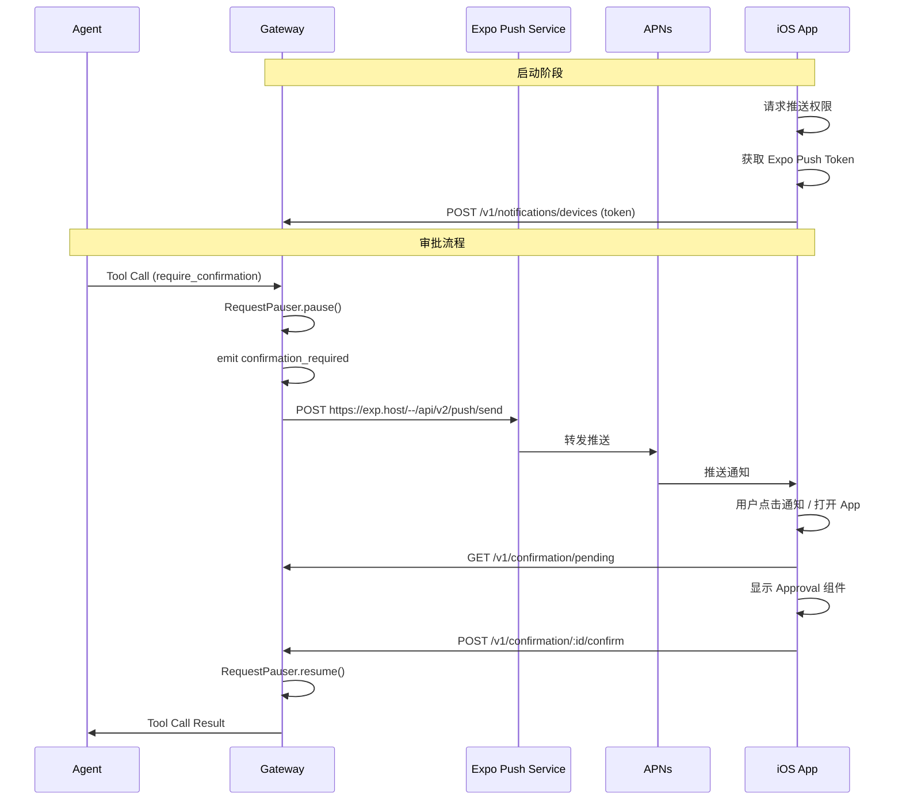

# APNs Push Notification + iOS Approval Flow

## 架构概览




Only use english in code

## Part 1: Gateway 端

### 1.1 新增 `deviceTokens` 数据库表

在 [src/db/schema.ts](src/db/schema.ts) 中新增表定义，遵循现有 Drizzle 模式：

```typescript
export const deviceTokens = pgTable('device_tokens', {
  id: text('id').primaryKey(),
  userId: text('user_id').notNull(),
  tenantId: text('tenant_id'),
  platform: text('platform').notNull(),        // 'ios' | 'macos' | 'android'
  pushToken: text('push_token').notNull(),      // Expo Push Token (ExponentPushToken[xxx])
  deviceName: text('device_name'),
  isActive: boolean('is_active').notNull().default(true),
  createdAt: timestamp('created_at').notNull(),
  updatedAt: timestamp('updated_at'),
});
```

然后运行 `pnpm db:generate` 和 `pnpm db:migrate` 生成迁移。

### 1.2 新增设备注册 API 路由

新建 `src/routes/notification/` 目录，包含：

- `**src/routes/notification/index.ts**` — 路由入口
- `**src/routes/notification/devices.ts**` — 设备 CRUD

端点：

- `POST /v1/notifications/devices` — 注册设备 (upsert by pushToken)
- `GET /v1/notifications/devices` — 列出当前用户的设备
- `DELETE /v1/notifications/devices/:id` — 注销设备

在 [src/index.ts](src/index.ts) 中挂载路由：`app.route('/v1/notifications', notificationRoutes)`

### 1.3 新增 Expo Push 通知服务

新建 `src/services/push.service/module.ts`，使用 Expo 推送 API：

- 调用 `https://exp.host/--/api/v2/push/send` 发送推送
- 无需 Apple .p8 密钥，Expo 代理转发到 APNs
- 根据 userId 查询 `deviceTokens` 表获取所有设备 token
- 处理推送回执（token 失效时标记 isActive=false）

核心方法：

```typescript
async sendConfirmationPush(userId: string, event: ConfirmationRequiredEvent): Promise<void>
```

推送 payload 包含 `confirmationId`、`toolName`、`risk` 等数据，用于 App 端路由。

### 1.4 新增 NotificationDispatcher

新建 `src/services/notification.service/module.ts`，订阅 `requestPauser` 的 `confirmation_required` 事件，触发 Expo Push：

```typescript
requestPauser.onConfirmationRequired(async (event) => {
  const targetUserId = event.user.endUserId || event.user.id;
  await pushService.sendConfirmationPush(targetUserId, event);
});
```

在 [src/index.ts](src/index.ts) 的 `ensureDbInitialized()` 末尾调用 `notificationDispatcher.init()`。

### 1.5 配置项

在 [src/config.ts](src/config.ts) 中无需新增配置（Expo Push 不需要服务端密钥）。如未来需要 Expo Access Token 可选添加 `EXPO_ACCESS_TOKEN` 环境变量。

---

## Part 2: iOS App 端 (simplaix-approval-app)

### 2.1 安装依赖

```bash
npx expo install expo-notifications expo-secure-store
```

- `expo-notifications` — 推送通知注册和处理
- `expo-secure-store` — 安全存储 API Token

### 2.2 配置 `app.json`

在 [simplaix-approval-app/app.json](simplaix-approval-app/app.json) 中：

- `plugins` 添加 `"expo-notifications"`
- `ios` 添加 `"infoPlist": { "UIBackgroundModes": ["remote-notification"] }`

### 2.3 新增设置页面 (Settings Tab)

新建 `src/app/settings.tsx`，提供：

- Gateway URL 输入框
- API Token 输入框（从 Dashboard 复制）
- 保存到 `expo-secure-store`
- 连接状态指示器

在 [src/components/app-tabs.tsx](simplaix-approval-app/src/components/app-tabs.tsx) 中添加 Settings tab。

### 2.4 新增 API 客户端

新建 `src/lib/api.ts`，封装 Gateway API 调用：

- `fetchPendingConfirmations()` — `GET /v1/confirmation/pending`
- `confirmRequest(id)` — `POST /v1/confirmation/:id/confirm`
- `rejectRequest(id, reason?)` — `POST /v1/confirmation/:id/reject`
- `registerDevice(pushToken, platform, deviceName)` — `POST /v1/notifications/devices`

从 SecureStore 读取 Gateway URL 和 Token，自动注入 Authorization header。

### 2.5 推送通知注册 Hook

新建 `src/hooks/use-push-notifications.ts`：

1. 请求通知权限
2. 获取 Expo Push Token (`Notifications.getExpoPushTokenAsync`)
3. 调用 `registerDevice()` 上报 token 到 Gateway
4. 注册 `CONFIRMATION_ACTION` category（Approve / Reject / Review 三个按钮）
5. 监听通知点击事件，路由到对应确认页面或直接调用 confirm/reject

### 2.6 改造首页为 Approval 列表

改造 [src/app/index.tsx](simplaix-approval-app/src/app/index.tsx) 为确认请求列表页：

- 轮询 `GET /v1/confirmation/pending`（10 秒间隔）
- 收到推送通知时立即刷新列表
- 空状态显示 "No pending approvals"

### 2.7 新增 Approval 组件

新建以下组件：

- `**src/components/confirmation-card.tsx**` — 确认卡片
  - 工具名称 + 风险等级徽章（颜色编码）
  - Agent 信息
  - 参数预览（JSON 折叠展示）
  - Approve / Reject 按钮
- `**src/app/confirmation/[id].tsx**` — 确认详情页（从列表或通知点击进入）
  - 完整参数展示
  - 拒绝原因输入框
  - Approve / Reject 操作

### 2.8 删除 Explore 页面

移除默认的 `src/app/explore.tsx` 和相关组件，替换为有意义的 Tab 结构：

- **Approvals** (首页) — 待确认列表
- **Settings** — Gateway 连接配置

---

## 文件变更总结

**Gateway (新增/修改):**

- `src/db/schema.ts` — 新增 `deviceTokens` 表
- `src/services/push.service/module.ts` + `index.ts` — Expo Push 服务 (新建)
- `src/services/notification.service/module.ts` + `index.ts` — 通知分发器 (新建)
- `src/routes/notification/devices.ts` + `index.ts` — 设备注册 API (新建)
- `src/index.ts` — 挂载通知路由 + 初始化 dispatcher
- `src/config.ts` — 可选添加 EXPO_ACCESS_TOKEN

**iOS App (新增/修改):**

- `app.json` — 添加 expo-notifications 插件配置
- `src/lib/api.ts` — API 客户端 (新建)
- `src/hooks/use-push-notifications.ts` — 推送注册 hook (新建)
- `src/app/index.tsx` — 改为 Approval 列表页
- `src/app/settings.tsx` — 设置页面 (新建)
- `src/app/confirmation/[id].tsx` — 确认详情页 (新建)
- `src/components/confirmation-card.tsx` — 确认卡片组件 (新建)
- `src/components/risk-badge.tsx` — 风险等级徽章 (新建)
- `src/components/app-tabs.tsx` — 更新 Tab 结构
- `src/app/explore.tsx` — 删除

