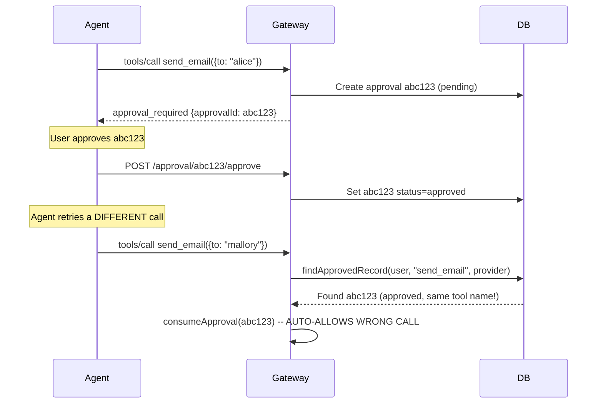
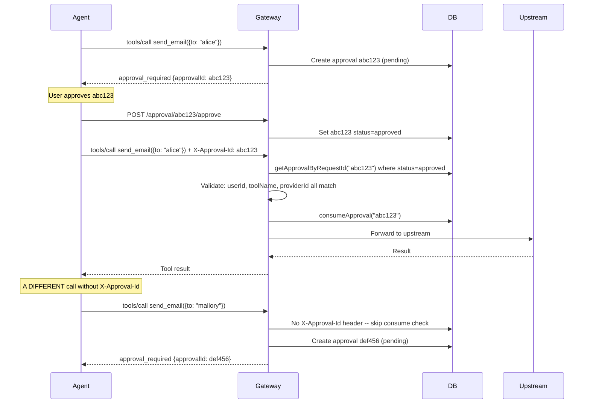
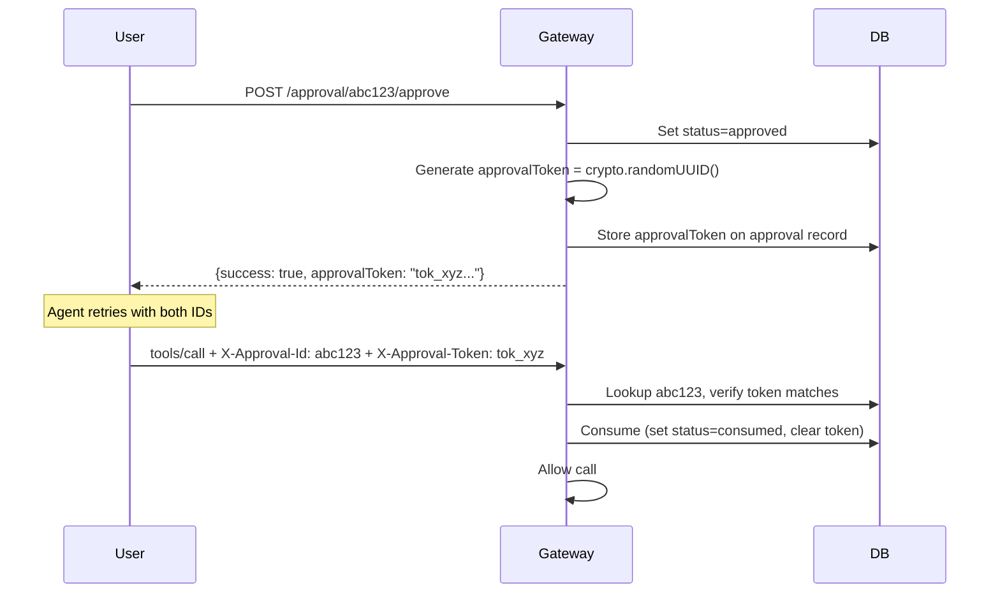

# Approval Correlation Fix: Explicit ID + One-Time Token

## Problem

`findApprovedRecord()` in [src/services/audit.service.ts](src/services/audit.service.ts) matches approvals by `(userId, toolName, providerId, status=approved, within 30min)`. This causes an old approval for the same tool name to be consumed by a completely unrelated call.

## Current Buggy Flow




## Phase 1: Explicit `X-Approval-Id` Correlation (Option 2)

The agent must pass back the `approvalId` when retrying. The gateway only consumes an approval that matches by exact ID, not by fuzzy tool name.

### Fixed Flow




### Changes

**1. [src/routes/mcp-proxy.ts](src/routes/mcp-proxy.ts) -- Replace fuzzy matching with explicit ID lookup**

- Read `X-Approval-Id` (or `X-MCP-Approval-Id`) from the incoming request header
- If present: look up that exact approval by `requestId`, validate `status === 'approved'` AND `userId`, `toolName`, `providerId` all match the current call. Consume it and allow.
- If absent or not found/not matching: skip the consume-on-retry path entirely. If policy says `require_approval`, always create a new pending approval.
- Remove the call to `findApprovedRecord()` entirely from the proxy flow.

**2. [src/services/audit.service.ts](src/services/audit.service.ts) -- Remove `findApprovedRecord()**`

- Delete the `findApprovedRecord()` method (the fuzzy matcher). It is no longer used.
- `consumeApproval()` and `getApprovalByRequestId()` remain as-is.

**3. [gateway-app/agent/main.py](gateway-app/agent/main.py) -- Update system prompt**

- Update the system prompt instruction about retry flow: the agent should include the `approvalId` as a header (or the agent framework handles it). Since the Python agent uses MCP client to call tools, the header injection may need to be handled at the MCP client level or by including the approvalId in the tool call arguments. 
- Simpler approach: also accept `approvalId` in the JSON-RPC body (`params._approvalId` or a top-level `meta` field) as a fallback, so agents that cannot set custom headers can still correlate.

**4. Accept `approvalId` in JSON-RPC body as fallback**

In [src/routes/mcp-proxy.ts](src/routes/mcp-proxy.ts), when parsing `tools/call`, also check:

- `jsonBody.params._approvalId`
- `jsonBody.params._meta?.approvalId`

This way the agent can pass it as a tool argument or MCP meta field instead of a header — making it work with any MCP client.

---

## Phase 2: One-Time Approval Token (Option 3)

After Phase 1 works, add a cryptographic single-use token for replay protection.

### Flow Addition




### Changes

**5. [src/db/schema.ts](src/db/schema.ts) -- Add `approvalToken` column**

- Add `approvalToken: text('approval_token')` to both `approvalsSqlite` and `approvalsPg`.
- Add `tokenExpiresAt: integer/timestamp` column for TTL enforcement.

**6. [src/db/index.ts](src/db/index.ts) -- Safe migration**

- Add the new columns via `ALTER TABLE approvals ADD COLUMN` in `initializeDatabase()`, wrapped in try/catch for idempotency.

**7. [src/services/audit.service.ts](src/services/audit.service.ts) -- Generate and validate tokens**

- In `updateApprovalByRequestId()`: when `approved === true`, generate a `crypto.randomUUID()` token, store it and set `tokenExpiresAt` to `now + 30 minutes`.
- Add `validateApprovalToken(requestId, token)` method: look up approval by requestId, check `status === 'approved'`, `approvalToken === token`, and `tokenExpiresAt > now`. Return the approval record or null.

**8. [src/routes/mcp-proxy.ts](src/routes/mcp-proxy.ts) -- Validate token on retry**

- Read `X-Approval-Token` header (or `params._meta?.approvalToken`) alongside `X-Approval-Id`.
- If both are present, call `validateApprovalToken(approvalId, token)` instead of just `getApprovalByRequestId()`.
- If only `approvalId` is present without token, reject with an error telling the caller a token is required.

**9. [src/routes/approval.ts](src/routes/approval.ts) -- Return token in approve response**

- When approval is granted (POST `/:id/approve` or `/:id/respond` with `approved: true`), include the generated `approvalToken` in the JSON response body:
  ```json
  { "success": true, "approvalToken": "tok_xyz...", "expiresIn": 1800 }
  ```

**10. [gateway-app/agent/main.py](gateway-app/agent/main.py) -- Update prompt for token**

- Update the system prompt to instruct the agent that the approval response includes an `approvalToken` which must be passed back on retry.

---

## Key Design Decisions

- **Header + JSON-RPC body fallback**: Agents that can set custom HTTP headers use `X-Approval-Id` / `X-Approval-Token`. Agents limited to MCP protocol pass them in `params._meta.approvalId` / `params._meta.approvalToken`.
- **No fuzzy matching at all**: If no approvalId is provided on a `require_approval` tool call, always create a new pending approval. This is the safe default.
- **Token is single-use**: Once validated, the approval is consumed atomically. The token cannot be replayed.
- **Token has TTL**: 30-minute expiry prevents stale approvals from being used days later.

