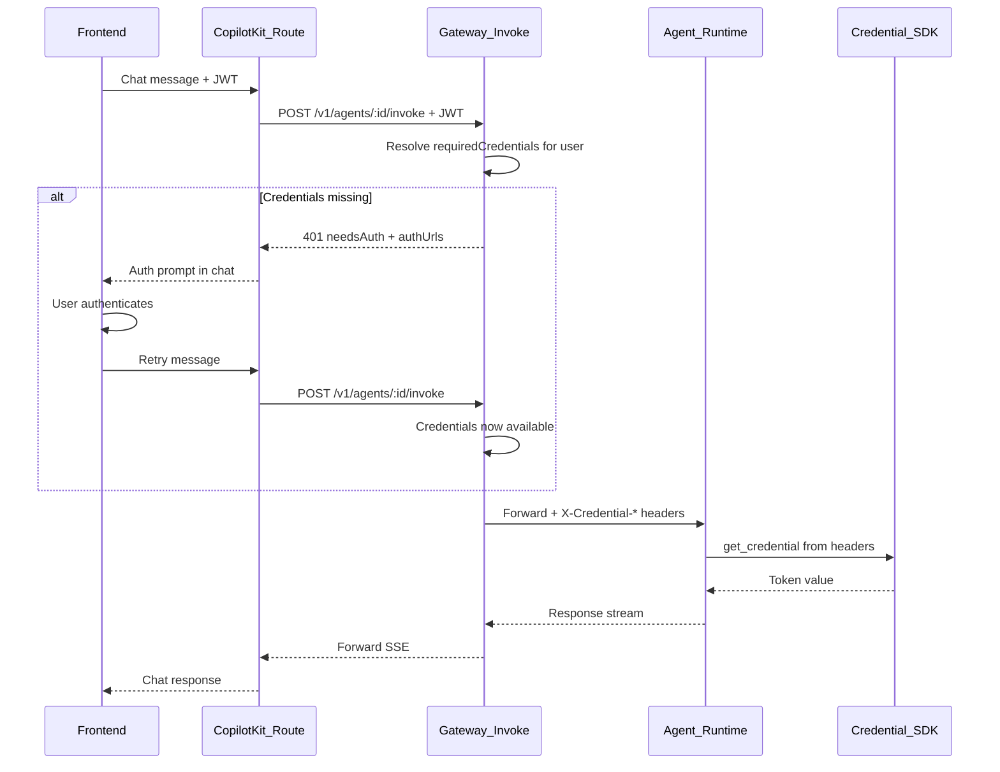

# Gateway-Level Auth Flow for Agents

## Current Problem

Auth flow logic (ContextVar, `@with_auth`, `AuthFlowRequired`, `check_auth_status` tool, system prompt instructions) lives inside the agent. This is fragile, duplicative, and not the agent's responsibility.

## Architecture




## Changes by Layer

### Layer 1: Gateway — Credential pre-check in invoke route

**File:** [src/routes/agent.ts](src/routes/agent.ts)

After loading the agent and before forwarding to the runtime, add:

- If agent has `requiredCredentials`, call `credentialService.resolveCredentials(user.id, serviceTypes, user.tenantId)`
- If any credentials are **missing**, return HTTP 401 with a structured response:

```json
  { "code": "CREDENTIALS_REQUIRED", "missing": ["gateway_api"], "authUrls": { "gateway_api": "/auth/connect?service=gateway_api" } }
  

```

- If all credentials are **available**, inject them as headers to the agent runtime:
  - `X-Credential-gateway_api: <token_value>`
  - One header per credential, using the pattern `X-Credential-<serviceType>`

This mirrors the existing pattern in [src/services/mcp-proxy.service.ts](src/services/mcp-proxy.service.ts) (lines 50-70).

### Layer 2: SDK — Read credentials from headers

**File:** [packages/credential-sdk-python/simplaix_credential_sdk/client.py](packages/credential-sdk-python/simplaix_credential_sdk/client.py)

Add a second ContextVar (or dict) to hold **pre-resolved credentials** from headers:

- New module-level: `_injected_credentials: ContextVar[dict]` to store credentials read from headers
- New middleware method: `starlette_middleware()` updated to also read `X-Credential-`* headers and store them
- Updated `resolve()` / `get_credential()`: check injected credentials first; if present, return immediately without making an HTTP call to the Gateway
- This makes the SDK a zero-network-call layer when credentials are injected by the Gateway

### Layer 3: Frontend — Handle `CREDENTIALS_REQUIRED` from Gateway

**File:** [gateway-app/src/app/api/copilotkit/route.ts](gateway-app/src/app/api/copilotkit/route.ts)

The CopilotKit `HttpAgent` will receive a 401 from the Gateway. We need to catch this and return an auth prompt to the user. Two sub-options:

- **Option A (simpler):** Before calling `handleRequest`, make a lightweight pre-check call to the Gateway (e.g., `GET /v1/agents/:id/credentials-check`) to see if credentials are available. If not, return a synthetic chat response with the auth prompt. This avoids needing to intercept streaming errors.
- **Option B (cleaner):** Wrap the `handleRequest` call in a try/catch. If the Gateway returns 401 `CREDENTIALS_REQUIRED`, construct an SSE stream response containing a text message with the auth URLs.

I recommend **Option A** because it's simpler and doesn't require manipulating the AG-UI/SSE protocol. It adds one lightweight request per chat message but avoids complexity.

### Layer 4: Agent cleanup

**File:** [gateway-app/agent/main.py](gateway-app/agent/main.py)

Remove all auth-related code:

- `AuthFlowRequired` exception class
- `resolve_gateway_credential()` function
- `with_auth` decorator
- `_auth_required_response()` helper
- `check_auth_status` tool
- Auth flow instructions from `system_prompt`
- The `@with_auth` decorator from all 17+ tool functions

Replace `get_authenticated_client()` with:

```python
def get_authenticated_client() -> GatewayClient:
    cred_client = _get_credential_client()
    token = run_async(cred_client.get_credential("gateway_api"))
    return get_gateway_client(credential_token=token)
```

The SDK reads the credential from the `X-Credential-gateway_api` header (injected by Gateway) — no network call needed.

### Frontend cleanup

Remove auth-related UI hooks and components that are no longer needed since the CopilotKit route handles it:

- Simplify `useAuthAwareDefaultTool` in [gateway-app/src/hooks/use-auth-tools.tsx](gateway-app/src/hooks/use-auth-tools.tsx)
- The `ErrorResult` auth check in [gateway-app/src/components/shared/result-cards.tsx](gateway-app/src/components/shared/result-cards.tsx) can be reverted
- Keep `AuthPrompt` component — it's still used, just triggered differently (from CopilotKit route instead of tool results)

## Key Benefits

- **Agent is completely auth-unaware** — no decorators, no exceptions, no auth tools, no system prompt instructions
- **Gateway owns the auth flow** — same pattern as MCP proxy, consistent across all agents
- **SDK is zero-network when Gateway injects credentials** — credentials come via headers, no extra HTTP calls
- **Every new agent gets auth for free** — just set `requiredCredentials` in agent config
- **Auth flow is deterministic** — no LLM involved in presenting auth links

