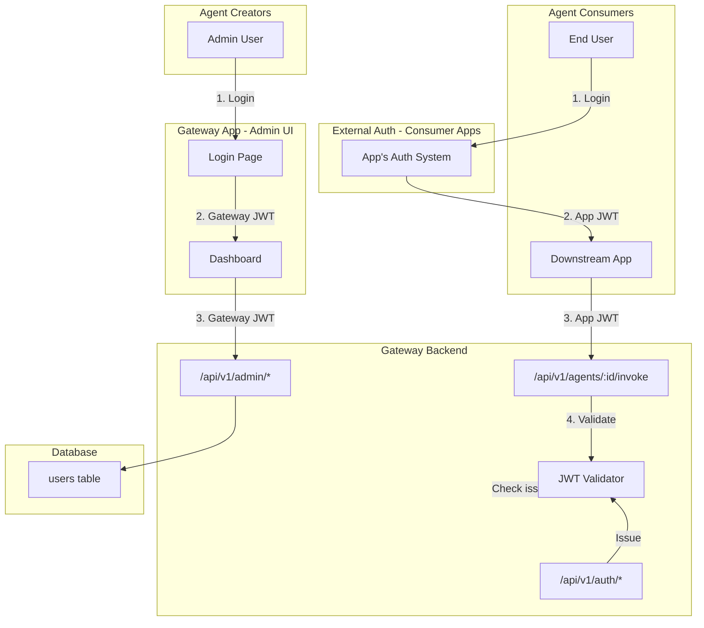
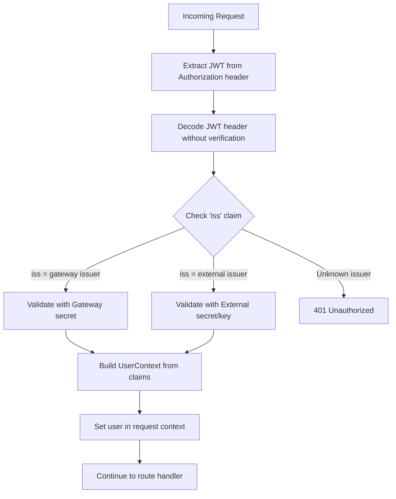

# Gateway Dual-Auth System

## Architecture Overview




## Two Authentication Modes

### Mode 1: Gateway-Issued JWT (Agent Creators)

- Used by: Admin users accessing gateway-app
- Flow: Login with email/password -> Gateway issues JWT
- JWT contains: user id, email, tenant_id, roles (from gateway DB)
- Issuer: `simplaix-gateway` (or configured value)

### Mode 2: External JWT (Agent Consumers)

- Used by: Downstream application users calling agents
- Flow: User authenticates with their app -> App passes JWT to Gateway
- JWT contains: sub (user id), any custom claims from external system
- Issuer: Configured external issuer (e.g., `https://auth.mycompany.com`)
- Gateway validates using shared secret or public key

## JWT Validation Flow

NOTE: Use popular package to do validation if possible.




## Configuration

```env
# Gateway JWT (for Agent Creators)
JWT_SECRET=gateway-secret-key-change-in-production
JWT_EXPIRES_IN=24h
JWT_ISSUER=simplaix-gateway

# External JWT Issuers (for Agent Consumers)
# Format: JSON array of issuer configs
JWT_EXTERNAL_ISSUERS='[
  {
    "issuer": "https://auth.mycompany.com",
    "secret": "shared-secret-with-consumer-app",
    "audience": "simplaix-gateway"
  },
  {
    "issuer": "https://login.microsoftonline.com/{tenant}/v2.0",
    "jwksUri": "https://login.microsoftonline.com/{tenant}/discovery/v2.0/keys",
    "audience": "api://simplaix-gateway"
  }
]'

# Initial Admin User
ADMIN_EMAIL=admin@example.com
ADMIN_PASSWORD=changeme
```

## Database Schema

Add to [src/db/schema.ts](src/db/schema.ts):

```typescript
// Users table (for Gateway-managed users - Agent Creators)
export const usersSqlite = sqliteTable('users', {
  id: text('id').primaryKey(),
  email: text('email').notNull().unique(),
  passwordHash: text('password_hash').notNull(),
  name: text('name'),
  tenantId: text('tenant_id'),
  isActive: integer('is_active', { mode: 'boolean' }).default(true),
  createdAt: integer('created_at', { mode: 'timestamp' }),
  updatedAt: integer('updated_at', { mode: 'timestamp' }),
});

// User roles
export const userRolesSqlite = sqliteTable('user_roles', {
  id: text('id').primaryKey(),
  userId: text('user_id').notNull().references(() => usersSqlite.id),
  role: text('role').notNull(), // 'admin', 'agent_creator', 'tenant_admin'
  createdAt: integer('created_at', { mode: 'timestamp' }),
});
```

Note: Agent Consumers are NOT stored in gateway DB. They are validated via their JWT only.

## Updated Auth Service

[src/services/auth.service.ts](src/services/auth.service.ts):

```typescript
interface IssuerConfig {
  issuer: string;
  secret?: string;      // For HMAC (HS256)
  jwksUri?: string;     // For RSA/EC (RS256, ES256)
  audience?: string;
}

class AuthService {
  private gatewayIssuer: string;
  private gatewaySecret: string;
  private externalIssuers: IssuerConfig[];
  
  // Issue JWT for gateway users (Agent Creators)
  issueJWT(user: User, roles: string[]): string {
    return jwt.sign({
      sub: user.id,
      email: user.email,
      tenant_id: user.tenantId,
      roles: roles,
      iss: this.gatewayIssuer,
    }, this.gatewaySecret, { expiresIn: '24h' });
  }
  
  // Verify any JWT (gateway or external)
  async verifyJWT(token: string): Promise<UserContext> {
    // 1. Decode without verification to get issuer
    const decoded = jwt.decode(token, { complete: true });
    const issuer = decoded?.payload?.iss;
    
    // 2. Find matching issuer config
    if (issuer === this.gatewayIssuer) {
      return this.verifyGatewayJWT(token);
    }
    
    const externalConfig = this.externalIssuers.find(c => c.issuer === issuer);
    if (externalConfig) {
      return this.verifyExternalJWT(token, externalConfig);
    }
    
    throw new Error('Unknown JWT issuer');
  }
  
  private verifyGatewayJWT(token: string): UserContext { ... }
  private verifyExternalJWT(token: string, config: IssuerConfig): UserContext { ... }
}
```

## API Endpoints

### Creator Auth Routes ([src/routes/auth.ts](src/routes/auth.ts))


| Method | Endpoint               | Description                |
| ------ | ---------------------- | -------------------------- |
| POST   | `/api/v1/auth/login`   | Login, returns gateway JWT |
| POST   | `/api/v1/auth/refresh` | Refresh gateway JWT        |
| GET    | `/api/v1/auth/me`      | Get current user profile   |


### Agent Routes (existing, updated validation)


| Method | Endpoint                    | Auth          | Description                          |
| ------ | --------------------------- | ------------- | ------------------------------------ |
| POST   | `/api/v1/agents/:id/invoke` | Any valid JWT | Invoke agent (creators or consumers) |


### Admin Routes (gateway JWT only)


| Method | Endpoint          | Auth                                | Description          |
| ------ | ----------------- | ----------------------------------- | -------------------- |
| *      | `/api/v1/admin/*` | Gateway JWT with admin/creator role | All admin operations |


## Test Script

Create [scripts/test-auth.sh](scripts/test-auth.sh):

```bash
#!/bin/bash
# Test both authentication flows

GATEWAY_URL="http://localhost:3000"

echo "=== Test 1: Gateway JWT (Agent Creator) ==="

# Login as admin
CREATOR_JWT=$(curl -s -X POST "$GATEWAY_URL/api/v1/auth/login" \
  -H "Content-Type: application/json" \
  -d '{"email":"admin@example.com","password":"changeme"}' \
  | jq -r '.token')

echo "Creator JWT: ${CREATOR_JWT:0:50}..."

# Use JWT to create an agent
curl -s -X POST "$GATEWAY_URL/api/v1/admin/agents" \
  -H "Authorization: Bearer $CREATOR_JWT" \
  -H "Content-Type: application/json" \
  -d '{"name":"Test Agent","upstreamUrl":"http://localhost:8080"}'

echo ""
echo "=== Test 2: External JWT (Agent Consumer) ==="

# Generate a test JWT with external issuer
# In real scenario, this comes from downstream app's auth system
EXTERNAL_JWT=$(node -e "
const jwt = require('jsonwebtoken');
const token = jwt.sign({
  sub: 'consumer-user-123',
  email: 'user@downstream-app.com',
  iss: 'https://auth.mycompany.com',
  aud: 'simplaix-gateway'
}, 'shared-secret-with-consumer-app', { expiresIn: '1h' });
console.log(token);
")

echo "External JWT: ${EXTERNAL_JWT:0:50}..."

# Use external JWT to invoke an agent
curl -s -X POST "$GATEWAY_URL/api/v1/agents/test-agent-id/invoke" \
  -H "Authorization: Bearer $EXTERNAL_JWT" \
  -H "Content-Type: application/json" \
  -d '{"method":"tools/list"}'

echo ""
echo "=== Test 3: Invalid JWT (should fail) ==="

curl -s -X POST "$GATEWAY_URL/api/v1/agents/test-agent-id/invoke" \
  -H "Authorization: Bearer invalid-token" \
  -H "Content-Type: application/json" \
  -d '{"method":"tools/list"}'
```

## Simple Node.js Test

Create [scripts/test-auth.js](scripts/test-auth.js):

```javascript
const jwt = require('jsonwebtoken');

// Configuration (should match gateway config)
const GATEWAY_SECRET = 'gateway-secret-key-change-in-production';
const GATEWAY_ISSUER = 'simplaix-gateway';
const EXTERNAL_SECRET = 'shared-secret-with-consumer-app';
const EXTERNAL_ISSUER = 'https://auth.mycompany.com';

// Simulate Gateway issuing JWT for Agent Creator
function issueCreatorToken() {
  return jwt.sign({
    sub: 'admin-user-1',
    email: 'admin@example.com',
    tenant_id: 'tenant-1',
    roles: ['admin', 'agent_creator'],
    iss: GATEWAY_ISSUER,
  }, GATEWAY_SECRET, { expiresIn: '24h' });
}

// Simulate External App issuing JWT for Agent Consumer
function issueConsumerToken() {
  return jwt.sign({
    sub: 'consumer-user-123',
    email: 'user@downstream-app.com',
    iss: EXTERNAL_ISSUER,
    aud: 'simplaix-gateway',
  }, EXTERNAL_SECRET, { expiresIn: '1h' });
}

// Gateway's verification logic
function verifyToken(token) {
  // Decode without verification first
  const decoded = jwt.decode(token, { complete: true });
  const issuer = decoded?.payload?.iss;
  
  console.log(`Token issuer: ${issuer}`);
  
  if (issuer === GATEWAY_ISSUER) {
    console.log('-> Validating as Gateway JWT');
    return jwt.verify(token, GATEWAY_SECRET);
  }
  
  if (issuer === EXTERNAL_ISSUER) {
    console.log('-> Validating as External JWT');
    return jwt.verify(token, EXTERNAL_SECRET, { audience: 'simplaix-gateway' });
  }
  
  throw new Error(`Unknown issuer: ${issuer}`);
}

// Run tests
console.log('=== Test 1: Creator Token ===');
const creatorToken = issueCreatorToken();
console.log('Token:', creatorToken.substring(0, 50) + '...');
const creatorPayload = verifyToken(creatorToken);
console.log('Verified payload:', creatorPayload);

console.log('\n=== Test 2: Consumer Token ===');
const consumerToken = issueConsumerToken();
console.log('Token:', consumerToken.substring(0, 50) + '...');
const consumerPayload = verifyToken(consumerToken);
console.log('Verified payload:', consumerPayload);

console.log('\n=== Test 3: Invalid Issuer ===');
const badToken = jwt.sign({ sub: 'hacker', iss: 'unknown-issuer' }, 'some-key');
try {
  verifyToken(badToken);
} catch (e) {
  console.log('Rejected:', e.message);
}
```

## Implementation Order

1. **Multi-issuer JWT validation** - Update AuthService to handle both gateway and external JWTs
2. **Database schema** - Add users and roles tables
3. **User service** - CRUD for gateway users
4. **Auth endpoints** - Login/register for creators
5. **Permission middleware** - Role-based access control
6. **Gateway-app auth** - Login page and session management
7. **Test scripts** - Validate both auth flows

## Security Notes

- Gateway secret and external secrets must be different
- External issuers should use HTTPS in production
- Consider JWKS (public key) validation for external issuers in production
- Rate limit login endpoints
- Log authentication failures for security monitoring

