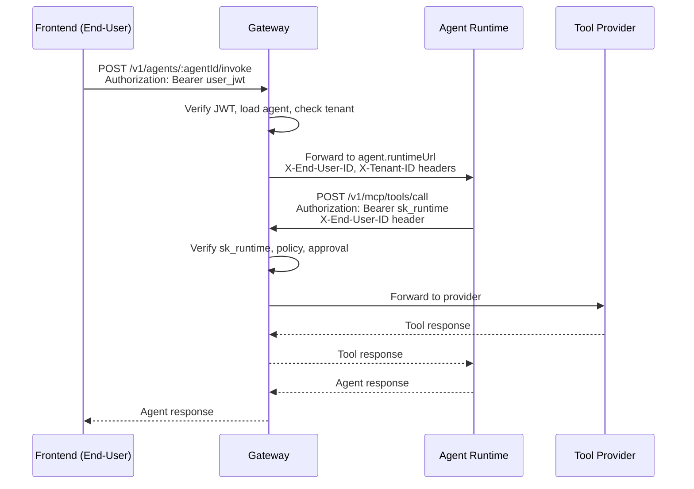
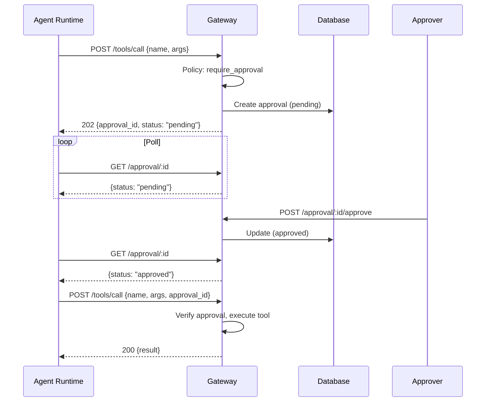

# Simplaix Gateway - Gap Analysis

Based on the sequence diagram requirements vs current implementation.

---

## Target Architecture




**Key distinction:**

- `/v1/agents/:agentId/invoke` - Called by **frontends** with **user JWT**
- `/v1/mcp/*` - Called by **agent runtimes** with **sk_runtime token**

---

## Implemented Features


| Feature                | Status             | Notes                                |
| ---------------------- | ------------------ | ------------------------------------ |
| JWT Authentication     | Done               | Extracts user_id, tenant_id, roles   |
| Agent Token (sk_) Auth | Done               | Verifies token, loads agent context  |
| Agent Kill Switch      | Done               | Checked on every token verification  |
| Policy Evaluation      | Partial            | Config-based, not tenant/agent aware |
| Human Approval Flow    | **Needs Refactor** | Blocks HTTP for 5min - timeout risk  |
| Audit Logging          | Partial            | Missing agentId field                |
| Admin Agent CRUD       | Done               | But no tenant isolation              |
| SSE Notifications      | Done               | APPROVAL_REQUIRED, APPROVAL_RESOLVED |


---

## Missing Features - Detailed Analysis

### 1. Agent Invoke Endpoint (CRITICAL)

**Required:** `POST /v1/agents/:agentId/invoke`

**Current State:** Does not exist. Gateway only handles tool calls, not agent invocations.

**What's Needed:**

- New endpoint that accepts user JWT
- Load agent by `:agentId` with tenant + permission check
- Forward request to `agent.runtimeUrl` (currently `upstreamUrl`)
- Inject context headers to runtime

**Files to modify:**

- Create `src/routes/agent.ts`
- Update `src/index.ts` to mount route
- Update `src/services/agent.service.ts` for tenant-aware lookup

---

### 2. End-User Header Forwarding (CRITICAL)

**Flow:** When runtime calls `/v1/mcp/tools/call`, it passes end-user context via headers:

```
Runtime → Gateway:
  Authorization: Bearer sk_runtime_xxx
  X-End-User-ID: user_123        ← Original user who called /invoke
  X-End-User-Roles: admin,user   ← Original user's roles
```

**Current State:** When sk_ token is used, user context is synthesized:

- `user.id = "agent:${agent.id}"` (fake - not the real end-user)
- No `X-End-User-ID` or `X-End-User-Roles` reading

**What's Needed in `[src/middleware/auth.ts](src/middleware/auth.ts)`:**

```typescript
// When sk_ token is used, read end-user context from headers:
const endUserId = c.req.header('X-End-User-ID');
const endUserRoles = c.req.header('X-End-User-Roles')?.split(',');

c.set('endUser', { id: endUserId, roles: endUserRoles });
c.set('agent', agent);  // Keep agent context separate
```

This allows policy/audit to know both **which agent** and **which end-user** triggered the tool call.

---

### 3. Tool Provider Routing (CRITICAL)

**Required:** Dynamic provider resolution by tool_name + tenant_id

**Current State:** No `tool_providers` table. Routing is:

- `agent.upstreamUrl` if agent token
- `config.mcpServerUrl` as fallback

**What's Needed:**

New DB table `tool_providers`:

```sql
CREATE TABLE tool_providers (
  id TEXT PRIMARY KEY,
  tenant_id TEXT,
  name TEXT NOT NULL,
  pattern TEXT NOT NULL,  -- glob pattern like 'slack_*', 'github_*'
  endpoint TEXT NOT NULL,
  auth_type TEXT,         -- 'bearer', 'api_key', 'none'
  auth_secret TEXT,
  is_active BOOLEAN DEFAULT true,
  priority INTEGER DEFAULT 0,
  created_at TIMESTAMP,
  updated_at TIMESTAMP
);
```

New service `tool-provider.service.ts`:

- `resolveProvider(tenantId, toolName)` - glob match
- Return 404 if no match
- Return 409 if ambiguous matches

---

### 4. Tenant-Aware Policy Engine (IMPORTANT)

**Required:** Policy evaluation with context:

```typescript
{
  tenant_id,
  agent_id,
  end_user_id,
  tool_name,
  arguments
}
```

**Current State in `[src/services/policy.service.ts](src/services/policy.service.ts)`:**

```17:17:src/services/policy.service.ts
  evaluate(toolName: string): PolicyEvaluationResult {
```

Only evaluates `toolName`, ignoring all other context.

**What's Needed:**

- Extend `evaluate()` signature to accept full context
- Support per-tenant and per-agent policy rules
- Consider DB-based policies (not just config)

---

### 5. Tenant Isolation in Agent Operations (IMPORTANT)

**Current State in `[src/services/agent.service.ts](src/services/agent.service.ts)`:**

- `getAgent(id)` - No tenant check
- `updateAgent(id, data)` - No tenant check
- `deleteAgent(id)` - No tenant check

**What's Needed:**

- Add `tenantId` parameter to CRUD operations
- Verify `agent.tenantId === requester.tenantId`
- 403 on mismatch

---

### 6. Audit Log Enhancement (MINOR)

**Current fields:** userId, tenantId, toolName, arguments, result, approvalId, status

**Missing fields:**

- `agentId` - Which agent made the call
- `endUserId` - Original end-user (vs agent token owner)

---

### 7. Approval Card Enhancement (MINOR)

**Current SSE event:**

```json
{
  "id": "...",
  "action": "tool_name",
  "params": {},
  "risk": "high"
}
```

**Missing:**

- `agentId` / `agentName`
- `endUserId`
- `tenantId`

---

### 8. Async Approval Flow (CRITICAL REFACTOR)

**Problem:** Current implementation blocks HTTP request for up to 5 minutes waiting for approval.

```typescript
// Current: BLOCKS the HTTP connection
const result = await requestPauser.pause({...});  // waits up to 5min
```

This causes:

- HTTP connection timeouts
- Load balancer timeouts
- Poor agent runtime experience

**Solution:** Async approval with polling/SSE




**Changes to `/v1/mcp/tools/call`:**

```typescript
// NEW: Return 202 immediately if approval required
if (policyResult.action === 'require_approval') {
  const approvalId = await auditService.recordApproval({...});
  return c.json({
    status: 'pending_approval',
    approval_id: approvalId,
    message: 'Tool call requires approval',
  }, 202);
}

// If approval_id provided, verify it's approved before executing
if (body.approval_id) {
  const approval = await auditService.getApproval(body.approval_id);
  if (approval.status !== 'approved') {
    return c.json({ error: 'Approval not granted' }, 403);
  }
  // Continue to execute tool...
}
```

**Files to modify:**

- `src/routes/mcp.ts` - Return 202 instead of blocking
- `src/services/pauser.service.ts` - Remove blocking logic (or keep for SSE only)
- `src/routes/approval.ts` - Add `GET /approval/:id` for polling

---

## Implementation Priority

### Phase 1 - Core Flow (Must Have)

1. **Async approval flow** - Return 202 + polling instead of blocking HTTP
2. Add `POST /v1/agents/:agentId/invoke` endpoint
3. Add end-user header forwarding (`X-End-User-ID`, `X-End-User-Roles`)
4. Add `tool_providers` table and routing service
5. Add tenant isolation to agent operations

### Phase 2 - Policy Enhancement (Should Have)

1. Extend policy engine to accept full context
2. Add `agentId` to audit logs
3. Enhance approval cards with agent context

### Phase 3 - Production Hardening (Nice to Have)

1. DB-based policies (per-tenant rules)
2. Provider ambiguity detection (409)
3. Approver authorization checks

---

## Files to Create/Modify


| File                                    | Action | Purpose                                     |
| --------------------------------------- | ------ | ------------------------------------------- |
| `src/routes/mcp.ts`                     | Modify | Return 202 for approval, accept approval_id |
| `src/routes/approval.ts`                | Modify | Add GET /approval/:id for polling           |
| `src/services/pauser.service.ts`        | Modify | Remove blocking, keep for SSE               |
| `src/routes/agent.ts`                   | Create | Agent invoke endpoint                       |
| `src/db/schema.ts`                      | Modify | Add tool_providers table                    |
| `src/services/tool-provider.service.ts` | Create | Provider resolution                         |
| `src/services/agent.service.ts`         | Modify | Tenant isolation                            |
| `src/middleware/auth.ts`                | Modify | End-user header reading                     |
| `src/services/policy.service.ts`        | Modify | Context-aware evaluation                    |
| `src/services/audit.service.ts`         | Modify | Add agentId field                           |
| `src/index.ts`                          | Modify | Mount agent routes                          |


