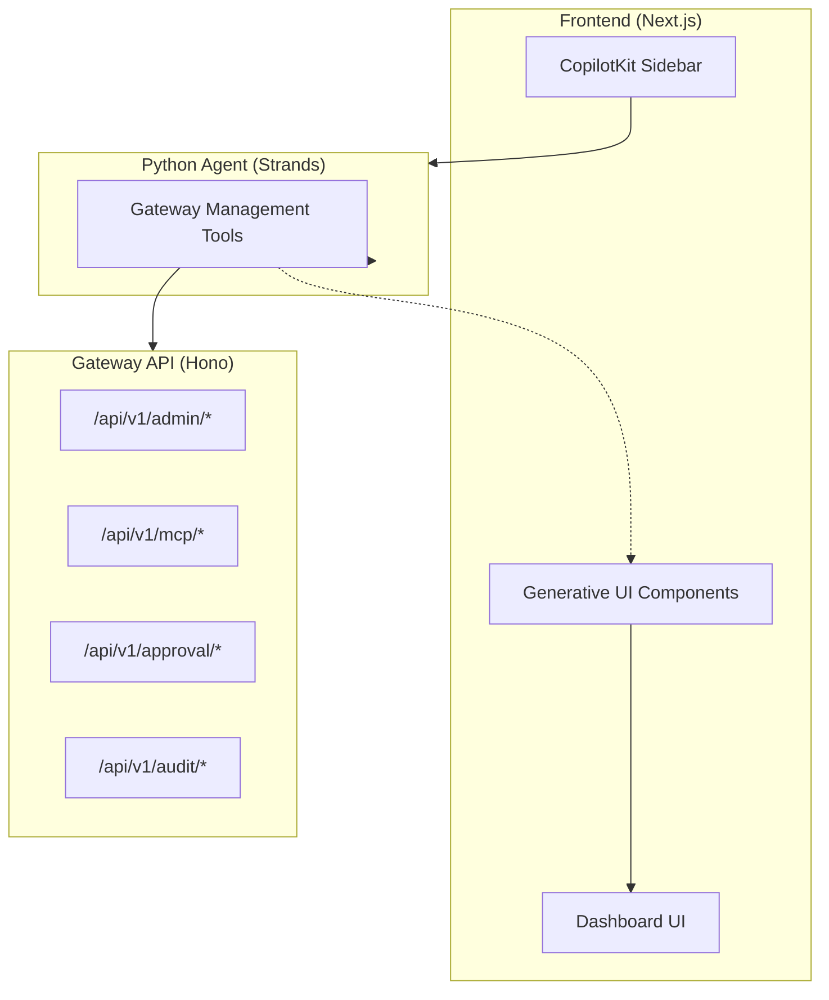

# Gateway Management Web App

## Architecture Overview

Transform the existing `gateway-app` from a demo proverbs app into a full gateway management dashboard. All management operations will be accessible via CopilotKit chatbot tools, with generative UI for rich feedback.




## Key Files to Modify

- `[gateway-app/agent/main.py](gateway-app/agent/main.py)` - Add management tools
- `[gateway-app/src/app/page.tsx](gateway-app/src/app/page.tsx)` - Replace with dashboard
- `[gateway-app/src/app/api/copilotkit/route.ts](gateway-app/src/app/api/copilotkit/route.ts)` - Update agent config
- New component files for generative UI

## 1. Python Agent Tools

Create tools in `[gateway-app/agent/main.py](gateway-app/agent/main.py)` that call the gateway API:

### Agent Management Tools

- `list_agents()` - List all agents with filtering
- `get_agent(agent_id)` - Get agent details
- `create_agent(name, upstream_url, description, require_approval)` - Create new agent
- `update_agent(agent_id, ...)` - Update agent configuration
- `delete_agent(agent_id)` - Delete an agent
- `toggle_agent(agent_id, enabled)` - Enable/disable agent

### Token Management Tools

- `list_tokens(agent_id)` - List tokens for an agent
- `create_token(agent_id, name, expires_in_days)` - Generate new token (returns the `sk_` key once)
- `revoke_token(token_id)` - Revoke a token
- `rotate_token(token_id)` - Rotate a token

### Tool Provider (MCP) Management Tools

- `list_tool_providers()` - List configured tool providers
- `create_tool_provider(name, pattern, endpoint, auth_type)` - Add new provider
- `update_tool_provider(id, ...)` - Update provider config
- `delete_tool_provider(id)` - Remove provider

### Approval Tools

- `list_pending_approvals()` - Get pending approval requests
- `approve_request(approval_id, reason)` - Approve a request
- `reject_request(approval_id, reason)` - Reject a request

### Audit Tools

- `get_audit_logs(filters)` - Query audit logs
- `get_audit_stats()` - Get audit statistics

## 2. Frontend Dashboard Components

### Main Dashboard Layout

Replace the proverbs demo with a tabbed/sectioned dashboard:

```
/src/app/page.tsx           - Main dashboard with tabs
/src/components/
  agents/
    agent-list.tsx          - Agent cards/table
    agent-card.tsx          - Single agent display
    agent-form.tsx          - Create/edit form (frontend tool)
  tokens/
    token-list.tsx          - Token table for an agent
    token-card.tsx          - Single token display
  tool-providers/
    provider-list.tsx       - Tool provider table
    provider-card.tsx       - Single provider display
  approvals/
    approval-list.tsx       - Pending approvals
    approval-card.tsx       - Single approval with actions
  audit/
    audit-log-table.tsx     - Audit log viewer
    audit-stats.tsx         - Statistics dashboard
  ui/
    data-table.tsx          - Reusable table component
    status-badge.tsx        - Status indicators
    loading-skeleton.tsx    - Loading states
```

### Generative UI Integration

Use `useRenderToolCall` for each tool to render rich UI:

```tsx
// Example: list_agents renders AgentList component
useRenderToolCall({
  name: "list_agents",
  render: (props) => <AgentList agents={props.result} />
});

// Example: create_agent renders success card with token info
useRenderToolCall({
  name: "create_agent",
  render: (props) => <AgentCreatedCard agent={props.result} />
});
```

## 3. Shared State Management

Use `useCoAgent` to sync dashboard state:

```tsx
const { state, setState } = useCoAgent({
  name: "gateway_agent",
  initialState: {
    agents: [],
    selectedAgentId: null,
    tokens: [],
    toolProviders: [],
    pendingApprovals: [],
    activeTab: 'agents'
  }
});
```

## 4. Frontend Tools

Add frontend tools for UI-only actions:

- `navigate_to_tab(tab_name)` - Switch dashboard tabs
- `select_agent(agent_id)` - Select agent for detail view
- `show_create_form(resource_type)` - Open create modal
- `refresh_data()` - Trigger data refresh

## 5. Configuration

### Environment Variables

Add to `[gateway-app/.env](gateway-app/.env)`:

```
GATEWAY_API_URL=http://localhost:3000
GATEWAY_JWT_TOKEN=<admin_jwt_token>
```

### API Client in Python Agent

Create a gateway API client that handles authentication and makes HTTP calls to the gateway endpoints.

## 6. UI/UX Design

- Use shadcn, and apply the skill /interface-design (under .cursor/skills/interface-design)
- Modern dashboard with sidebar navigation
- Tailwind CSS with consistent design system
- Dark/light mode support (already configured)
- Responsive design for mobile/tablet
- Loading states and error handling
- Confirmation dialogs for destructive actions

## Tech Stack (Unchanged)

- Next.js 16 + React 19
- CopilotKit 1.50.0
- Tailwind CSS 4
- Python + Strands + ag-ui-strands

