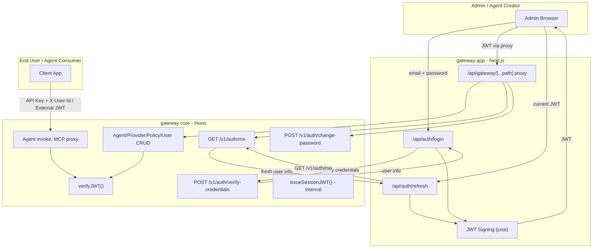

# JWT Issuance Separation: Gateway Core to Gateway-App

## Architecture After Change




## Key Design Decisions

- **Shared JWT_SECRET**: gateway-app signs tokens with the same `JWT_SECRET` and `JWT_ISSUER` as gateway core. Gateway core's `verifyGatewayJWT()` verifies them seamlessly -- zero middleware changes needed.
- **API-only approach**: gateway-app does NOT connect to the DB. It calls gateway core's HTTP API for credential verification and user data.
- **Session JWT stays**: `issueSessionJWT()` / `verifySessionJWT()` are internal gateway mechanisms for agent callbacks -- they remain untouched.
- **Self-registration removed**: New users are created by admins via `POST /v1/admin/users` (existing route, unchanged). If self-registration is needed later, add it to gateway-app.

---

## Gateway Core Changes

### 1. Modify [src/routes/auth.ts](src/routes/auth.ts)

**Remove:**

- `POST /login` (JWT issuance)
- `POST /register` (self-registration)
- `POST /refresh` (JWT re-issuance)

**Add:**

- `POST /verify-credentials` -- verifies email/password, returns user info (NO JWT). Protected by rate limiting (existing or new). Example response:

```json
{ "success": true, "user": { "id": "...", "email": "...", "name": "...", "tenantId": "...", "roles": ["admin"] } }
```

**Keep unchanged:**

- `GET /me` -- returns current user profile (uses `jwtAuthMiddleware`)
- `PUT /me` -- update profile (uses `jwtAuthMiddleware`)
- `POST /change-password` -- (uses `jwtAuthMiddleware`)

### 2. Modify [src/services/auth.service.ts](src/services/auth.service.ts)

**Remove:**

- `issueJWT()` (lines 166-188)

**Keep unchanged:**

- `verifyJWT()`, `verifyGatewayJWT()`, `verifyExternalJWTWithJWKS()`, `verifyExternalJWTWithSecret()`
- `extractToken()`, `AuthError`, `decodeJWTUnsafe()`
- `issueSessionJWT()`, `verifySessionJWT()`

### 3. Modify [src/config.ts](src/config.ts)

- Remove `jwtExpiresIn` from `loadConfig()` (only used by the removed `issueJWT`)
- Keep `jwtSecret`, `jwtPublicKey`, `jwtIssuer`, `jwtAudience`, `externalIssuers` (all needed for verification)
- Keep `adminEmail`, `adminPassword` (still needed for `ensureInitialAdmin`)

### 4. Modify [src/index.ts](src/index.ts)

- Keep `/v1/auth` route mount (still serves /me, /change-password, /verify-credentials)
- Keep `ensureInitialAdmin()` (bootstraps the first admin user)
- No other changes

### 5. No changes needed in:

- [src/middleware/auth.ts](src/middleware/auth.ts) -- all middleware unchanged
- [src/routes/admin.ts](src/routes/admin.ts) -- agent + user CRUD unchanged
- [src/routes/agent.ts](src/routes/agent.ts), [src/routes/mcp-proxy.ts](src/routes/mcp-proxy.ts), etc.
- [src/services/user.service.ts](src/services/user.service.ts) -- unchanged
- [src/db/schema.ts](src/db/schema.ts) -- unchanged

---

## Gateway-App Changes

### 6. Add `jose` dependency

```bash
pnpm add jose
```

### 7. Add env vars to [gateway-app/.env](gateway-app/.env)

```
JWT_SECRET=<same value as gateway core>
JWT_ISSUER=simplaix-gateway
JWT_EXPIRES_IN=24h
```

### 8. Create JWT helper: `gateway-app/src/lib/jwt.ts`

A small utility (~30 lines) that wraps `jose.SignJWT` to sign tokens with `JWT_SECRET`, including claims: `sub`, `email`, `tenant_id`, `roles`. Uses `JWT_ISSUER` and `JWT_EXPIRES_IN` from env.

### 9. Create `gateway-app/src/app/api/auth/login/route.ts`

Flow:

1. Receive `{ email, password }` from request body
2. Call gateway core `POST ${GATEWAY_API_URL}/api/v1/auth/verify-credentials` with the credentials
3. If gateway core returns success, sign JWT using the helper from step 8
4. Return `{ token, user }` to the client

### 10. Create `gateway-app/src/app/api/auth/refresh/route.ts`

Flow:

1. Read JWT from `Authorization: Bearer` header
2. Verify it locally using `jose.jwtVerify` (same `JWT_SECRET`)
3. Call gateway core `GET ${GATEWAY_API_URL}/api/v1/auth/me` with the current JWT to get fresh user data
4. Sign a new JWT with the fresh data
5. Return `{ token, user }`

### 11. Update [gateway-app/src/contexts/auth-context.tsx](gateway-app/src/contexts/auth-context.tsx)

- Change `login()` to call `/api/auth/login` (local) instead of `/api/gateway/auth/login` (proxy)
- Change `refreshToken()` to call `/api/auth/refresh` (local) instead of `/api/gateway/auth/refresh` (proxy)
- Keep `storeTokenAsCredential` calling `/api/gateway/credentials/jwt` (proxy, unchanged)

### 12. Update [gateway-app/src/lib/gateway-proxy/path-map.ts](gateway-app/src/lib/gateway-proxy/path-map.ts)

Line 57: the pass-through pattern `auth` still needs to work for `/auth/me` and `/auth/change-password` proxy calls. No change needed here -- the login/refresh requests will go to local routes (`/api/auth/*`) and never hit the proxy.

---

## What Does NOT Change (verification)

- `jwtAuthMiddleware` -- verifies JWT, extracts user context. Works identically since tokens are signed with the same secret/issuer.
- `flexibleAuthMiddleware` -- all 4 paths unchanged (art, API key + JWT/X-User-Id, JWT-only).
- `requireRoles` / `requirePermission` -- reads roles from JWT claims, unchanged.
- End-user auth -- API keys, external JWTs, X-User-Id all work as before. End users never need gateway-issued JWT.
- Agent CRUD, Provider CRUD, Policy CRUD, API Key management, Audit, Credentials -- all unchanged.

