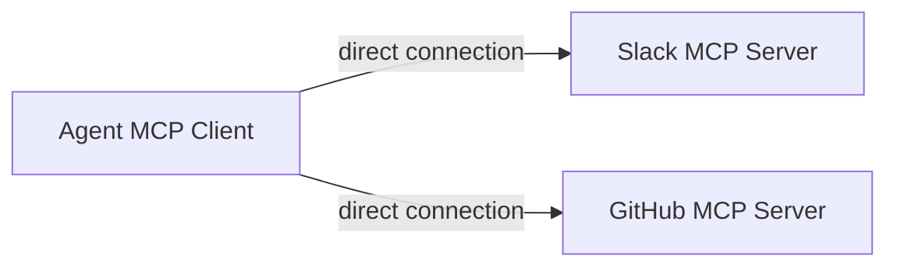
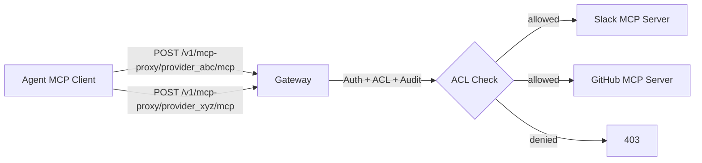

# Per-Provider MCP Proxy + Provider Access Control

## What the User Wants

1. **Unified MCP proxy per provider** -- Agent developers configure their MCP client to connect to `GATEWAY_URL/api/v1/mcp-proxy/{providerId}/mcp` instead of each upstream MCP server directly. The gateway transparently proxies the standard MCP Streamable HTTP protocol.
2. **Gateway-level ACL** -- Before proxying, verify that the calling user (or their role/group) has permission to access that provider.

## Current Architecture




Today, agents connect directly to each upstream MCP server. The gateway only proxies tool calls via a custom REST endpoint (`POST /v1/mcp/tools/call`), not the standard MCP protocol.

## Target Architecture




Agent developers configure each MCP client connection to point to the gateway:

```python
# Before: direct to upstream
MCPClient(lambda: streamablehttp_client(url="https://slack-mcp.example.com/mcp"))

# After: through gateway with auth
MCPClient(lambda: streamablehttp_client(
    url="https://gateway.example.com/api/v1/mcp-proxy/provider_abc/mcp",
    headers={"Authorization": "Bearer <jwt>", "X-Api-Key": "gk_xxx"}
))
```

## Implementation Plan

### 1. New Route: `/v1/mcp-proxy/:providerId/mcp`

**File:** New `src/routes/mcp-proxy.ts`

This route acts as a transparent HTTP reverse proxy for the MCP Streamable HTTP protocol. It:

- Authenticates the caller (`flexibleAuthMiddleware`)
- Resolves the provider from `providerId` param using [tool-provider.service.ts](src/services/tool-provider.service.ts) `getProvider(id)`
- Checks provider is active and tenant-scoped correctly
- **Checks ACL** (new, see below)
- Forwards the raw HTTP request (POST body) to `provider.endpoint` with provider auth headers injected
- Streams the response back (supports SSE for Streamable HTTP)
- Optionally: intercepts `tools/call` JSON-RPC methods for audit logging and policy checks

Key considerations:

- Must handle SSE streaming responses (Streamable HTTP uses `text/event-stream`)
- Provider's `authType` + `authSecret` should be injected as headers (already have logic in [mcp-proxy.service.ts](src/services/mcp-proxy.service.ts) lines 66-70)
- The caller's identity headers (`X-User-ID`, `X-Tenant-ID`, etc.) should also be forwarded

**Mount in** [src/index.ts](src/index.ts):

```typescript
app.route('/v1/mcp-proxy', mcpProxyRoutes);
```

### 2. Provider Access Rules (ACL)

**New DB table in** [src/db/schema.ts](src/db/schema.ts):

```sql
provider_access_rules (
  id              TEXT PRIMARY KEY,
  tenant_id       TEXT,
  subject_type    TEXT NOT NULL,  -- 'user' | 'role' | 'group'
  subject_id      TEXT NOT NULL,  -- user ID, role name, or group ID
  provider_id     TEXT NOT NULL,  -- references tool_providers.id, or '*' for all
  action          TEXT NOT NULL,  -- 'allow' | 'deny'
  created_at      TIMESTAMP NOT NULL,
  updated_at      TIMESTAMP
)
```

**New service:** `src/services/provider-access.service.ts`

Core method:

```typescript
async checkAccess(
  userId: string,
  roles: string[],
  providerId: string,
  tenantId?: string
): Promise<{ allowed: boolean; reason?: string }>
```

Evaluation order:

1. Check explicit user-level deny rules (deny takes precedence)
2. Check explicit user-level allow rules
3. Check role-level deny rules
4. Check role-level allow rules
5. Default: **deny** (whitelist model) or **allow** (blacklist model) -- configurable

CRUD methods: `createRule`, `listRules`, `deleteRule`, `getRulesForProvider`

### 3. Admin CRUD Routes for ACL

**New file:** `src/routes/provider-access.ts`

- `POST /v1/admin/provider-access` -- Create access rule
- `GET /v1/admin/provider-access` -- List rules (filter by `providerId`, `subjectType`, `subjectId`)
- `GET /v1/admin/provider-access/:id` -- Get rule by ID
- `DELETE /v1/admin/provider-access/:id` -- Delete rule

Protected by `gatewayJwtMiddleware` + `requirePermission('provider:update')`.

**Mount in** [src/index.ts](src/index.ts):

```typescript
app.route('/v1/admin/provider-access', providerAccessRoutes);
```

### 4. Integration: ACL in the Proxy Route

Inside the new `mcp-proxy` route, after resolving the provider and before forwarding:

```typescript
// Check ACL
const access = await providerAccessService.checkAccess(
  user.id, user.roles || [], provider.id, user.tenantId
);
if (!access.allowed) {
  return c.json({ error: 'Forbidden', message: access.reason, code: 'PROVIDER_ACCESS_DENIED' }, 403);
}
```

### 5. Optional: Intercept `tools/call` for Audit + Policy

For transparency, we can parse the JSON-RPC body. If the method is `tools/call`:

- Run the existing `PolicyService.evaluate()` for tool-level policy (deny/require_approval)
- Create an audit log entry via `AuditService`

For other methods (`tools/list`, `initialize`, `ping`), just proxy transparently.

### 6. Optional (Deferred): User Groups

If role-based ACL is insufficient, add:

- `groups` table: `id`, `tenantId`, `name`
- `user_groups` table: `userId`, `groupId`
- Extend `checkAccess()` to also query group memberships

This can be deferred until the user/role model proves insufficient.

## Files Changed/Created Summary

- **New:** `src/routes/mcp-proxy.ts` -- Per-provider MCP protocol proxy
- **New:** `src/services/provider-access.service.ts` -- ACL service
- **New:** `src/routes/provider-access.ts` -- Admin CRUD for ACL rules
- **Modified:** `src/db/schema.ts` -- Add `provider_access_rules` table (SQLite + PG)
- **Modified:** `src/types/index.ts` -- Add `ProviderAccessRule` interface
- **Modified:** `src/index.ts` -- Mount new routes

