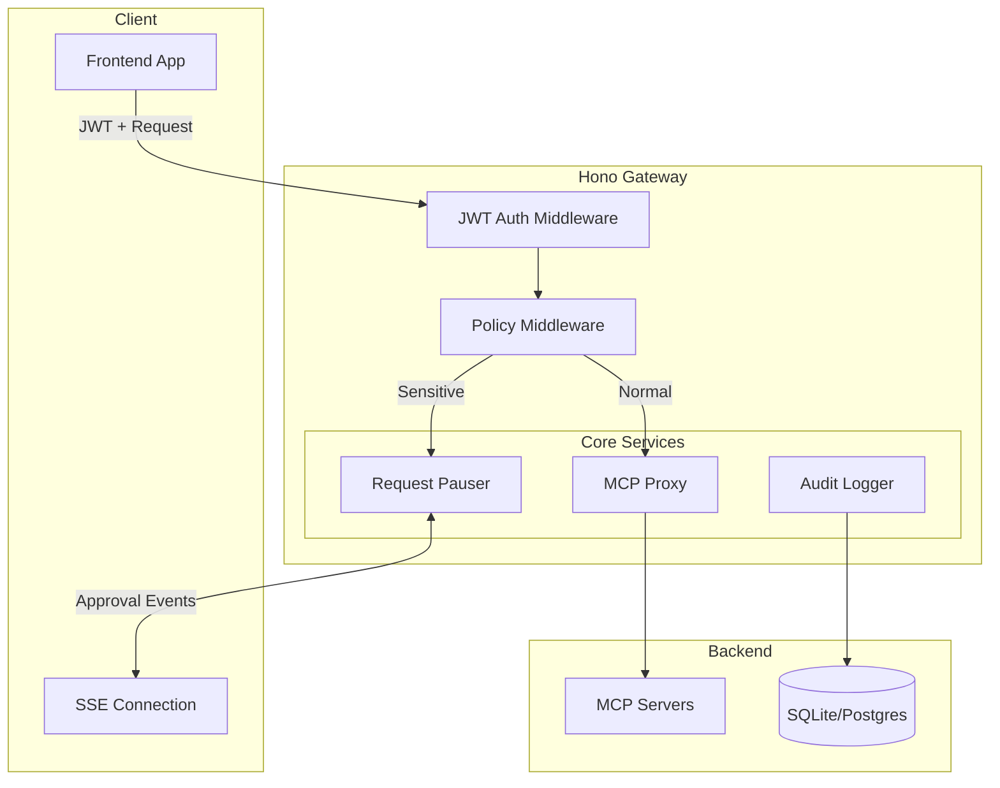

# MCP Gateway 实现计划

## 架构概览




## 技术栈

- **Web 框架**: Hono (已有)
- **JWT 验证**: `jose` 或 `@hono/jwt`
- **数据库**: `drizzle-orm` + `better-sqlite3` (开发) / `postgres` (生产)
- **SSE**: Hono 原生 streaming
- **请求挂起**: 内存 Map + EventEmitter 模式

## 目录结构

```
src/
├── index.ts                 # 入口，组装路由
├── middleware/
│   ├── auth.ts              # JWT 验证中间件
│   ├── policy.ts            # 策略检查中间件
│   └── audit.ts             # 审计日志中间件
├── services/
│   ├── auth.service.ts      # OIDC/JWT 处理
│   ├── policy.service.ts    # 策略引擎
│   ├── pauser.service.ts    # 请求挂起/恢复管理
│   ├── audit.service.ts     # 审计日志服务
│   └── mcp-proxy.service.ts # MCP 代理服务
├── routes/
│   ├── mcp.ts               # MCP 代理路由
│   ├── stream.ts            # SSE 流路由
│   ├── approval.ts          # 审批响应路由
│   └── audit.ts             # 审计日志查询路由
├── db/
│   ├── schema.ts            # Drizzle schema
│   └── index.ts             # 数据库连接
├── types/
│   └── index.ts             # 类型定义
└── config.ts                # 配置管理
```

---

## 阶段一：身份层 (Identity Layer)

### 1.1 JWT 验证中间件

`[src/middleware/auth.ts](src/middleware/auth.ts)` - 核心实现：

```typescript
// 验证 JWT，提取用户信息，注入到 context
export const authMiddleware = createMiddleware(async (c, next) => {
  const token = c.req.header('Authorization')?.replace('Bearer ', '')
  const payload = await verifyJWT(token, publicKey)
  c.set('user', { id: payload.sub, tenantId: payload.tenant_id })
  await next()
})
```

### 1.2 身份 Header 注入

代理请求时自动注入身份信息：

```typescript
// 转发到 MCP Server 时注入
headers['X-User-ID'] = c.get('user').id
headers['X-Tenant-ID'] = c.get('user').tenantId
```

---

## 阶段二：审批层 (Approval Layer) - 核心差异化

### 2.1 请求挂起池

`[src/services/pauser.service.ts](src/services/pauser.service.ts)`:

```typescript
interface PendingRequest {
  id: string
  userId: string
  toolName: string
  arguments: Record<string, unknown>
  resolve: (approved: boolean) => void
  createdAt: Date
}

class RequestPauser {
  private pending = new Map<string, PendingRequest>()
  private emitter = new EventEmitter()
  
  async pause(req: Omit<PendingRequest, 'resolve'>): Promise<boolean> {
    return new Promise((resolve) => {
      this.pending.set(req.id, { ...req, resolve })
      this.emitter.emit('approval_required', req)
    })
  }
  
  resume(id: string, approved: boolean) {
    const req = this.pending.get(id)
    req?.resolve(approved)
    this.pending.delete(id)
  }
}
```

### 2.2 SSE 推送审批请求

`[src/routes/stream.ts](src/routes/stream.ts)`:

```typescript
app.get('/v1/stream', async (c) => {
  return streamSSE(c, async (stream) => {
    const userId = c.get('user').id
    
    pauser.on('approval_required', async (req) => {
      if (req.userId === userId) {
        await stream.writeSSE({
          event: 'APPROVAL_REQUIRED',
          data: JSON.stringify({
            id: req.id,
            action: req.toolName,
            params: req.arguments,
            risk: calculateRisk(req.toolName)
          })
        })
      }
    })
  })
})
```

### 2.3 审批响应端点

`[src/routes/approval.ts](src/routes/approval.ts)`:

```typescript
app.post('/v1/approval/:id/respond', async (c) => {
  const { id } = c.req.param()
  const { approved } = await c.req.json()
  pauser.resume(id, approved)
  return c.json({ success: true })
})
```

---

## 阶段三：审计层 (Audit Layer)

### 3.1 数据库 Schema

`[src/db/schema.ts](src/db/schema.ts)`:

```typescript
export const auditLogs = sqliteTable('audit_logs', {
  id: text('id').primaryKey(),
  userId: text('user_id').notNull(),
  tenantId: text('tenant_id'),
  toolName: text('tool_name').notNull(),
  arguments: text('arguments'), // JSON
  result: text('result'),       // JSON
  approvalId: text('approval_id'),
  approvedBy: text('approved_by'),
  status: text('status'),       // pending | approved | rejected | completed
  createdAt: integer('created_at', { mode: 'timestamp' }),
  completedAt: integer('completed_at', { mode: 'timestamp' })
})
```

### 3.2 审计中间件

`[src/middleware/audit.ts](src/middleware/audit.ts)` - 异步记录，不阻塞请求：

```typescript
export const auditMiddleware = createMiddleware(async (c, next) => {
  const startTime = Date.now()
  await next()
  
  // 异步写入，不阻塞响应
  setImmediate(() => {
    auditService.log({
      userId: c.get('user').id,
      toolName: c.get('toolName'),
      arguments: c.get('toolArgs'),
      result: c.get('toolResult'),
      duration: Date.now() - startTime
    })
  })
})
```

---

## 阶段四：策略引擎

### 4.1 策略配置

`[src/config.ts](src/config.ts)` - YAML 或 JSON 配置：

```typescript
export const policies = {
  rules: [
    {
      tool: 'transfer_money',
      action: 'require_approval',
      risk: 'high'
    },
    {
      tool: 'read_*',
      action: 'allow',
      risk: 'low'
    },
    {
      tool: 'delete_*',
      action: 'require_approval',
      risk: 'critical'
    }
  ]
}
```

### 4.2 策略中间件

`[src/middleware/policy.ts](src/middleware/policy.ts)`:

```typescript
export const policyMiddleware = createMiddleware(async (c, next) => {
  const toolName = c.get('toolName')
  const policy = policyService.evaluate(toolName)
  
  if (policy.action === 'require_approval') {
    const approved = await pauser.pause({
      id: crypto.randomUUID(),
      userId: c.get('user').id,
      toolName,
      arguments: c.get('toolArgs')
    })
    if (!approved) {
      return c.json({ error: 'Request rejected by user' }, 403)
    }
  }
  
  await next()
})
```

---

## API 端点汇总


| 方法   | 路径                         | 描述             |
| ---- | -------------------------- | -------------- |
| POST | `/v1/mcp/tools/call`       | 代理 MCP tool 调用 |
| GET  | `/v1/stream`               | SSE 流，推送审批请求   |
| POST | `/v1/approval/:id/respond` | 用户审批响应         |
| GET  | `/v1/audit/logs`           | 审计日志查询         |
| GET  | `/health`                  | 健康检查           |


---

## 依赖列表

```json
{
  "dependencies": {
    "hono": "^4.11.7",
    "jose": "^5.2.0",
    "drizzle-orm": "^0.29.0",
    "better-sqlite3": "^9.4.0",
    "nanoid": "^5.0.0"
  },
  "devDependencies": {
    "@types/better-sqlite3": "^7.6.0",
    "drizzle-kit": "^0.20.0"
  }
}
```

---

## MVP 验收标准

1. 请求带 JWT 经过 Gateway，能正确提取 `user_id` 并注入到转发请求
2. 配置 `transfer_money` 工具需要审批，调用时前端能收到 SSE 事件
3. 用户点击"批准"后，请求继续执行；点击"拒绝"后，返回 403
4. 所有请求都有审计日志可查
5. gateway可以支持配置不同的数据库（先支持主流）

  
  
注意，所有代码和注释用英文写