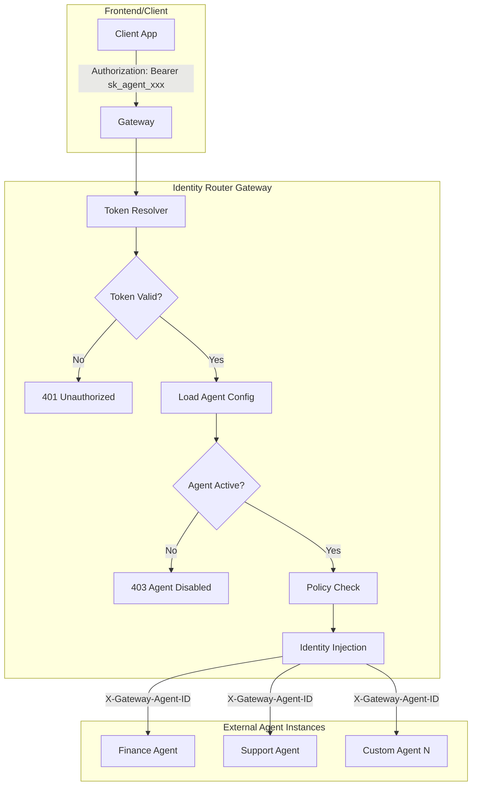
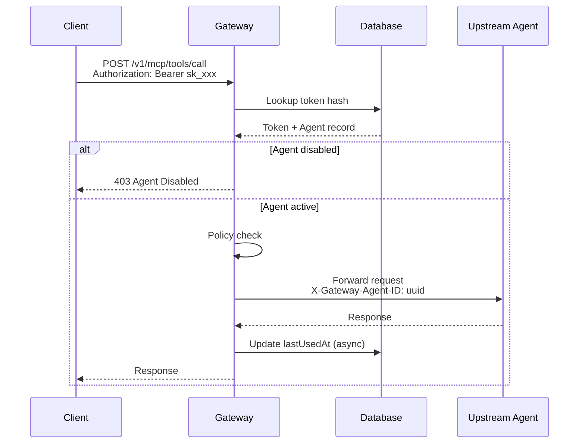

# P0: Virtual Agent Identity & Request Routing

## Overview

Transform the gateway into an **Identity Router** that manages Virtual Agent identities. Each agent is registered with an upstream URL, and clients use Agent Access Tokens (`sk_...`) to route requests to the correct backend.

**Key Concepts:**

- **Provider API Key** (e.g., Gemini Key) - stored in gateway config, used to call LLM providers
- **Agent Access Token** (`sk_...`) - generated by gateway, identifies which virtual agent to route to

## Architecture




## Database Schema

### 1. Agents Table - Virtual Agent Registry

```typescript
// src/db/schema.ts - SQLite version
export const agentsSqlite = sqliteTable('agents', {
  id: text('id').primaryKey(),              // Auto-assigned UUID (generated via nanoid/crypto.randomUUID)
  name: text('name').notNull(),             // Human-readable: "Finance Checker Bot"
  
  // Upstream routing
  upstreamUrl: text('upstream_url').notNull(), // https://finance-agent.internal/mcp
  upstreamSecret: text('upstream_secret'),     // Optional: secret for upstream auth
  
  // Governance
  isActive: integer('is_active', { mode: 'boolean' }).notNull().default(true),
  requireApproval: integer('require_approval', { mode: 'boolean' }).default(false),
  
  // Multi-tenancy
  tenantId: text('tenant_id'),              // Owner tenant
  ownerUserId: text('owner_user_id'),       // Creator user ID
  
  // Metadata
  description: text('description'),
  createdAt: integer('created_at', { mode: 'timestamp' }).notNull(),
  updatedAt: integer('updated_at', { mode: 'timestamp' }),
});
```

### 2. Agent Tokens Table - Access Tokens

```typescript
export const agentTokensSqlite = sqliteTable('agent_tokens', {
  id: text('id').primaryKey(),              // Token record ID
  agentId: text('agent_id').notNull(),      // References agents.id
  
  // Token data (key itself is hashed)
  tokenHash: text('token_hash').notNull(),  // SHA-256 hash of sk_xxx token
  tokenPrefix: text('token_prefix').notNull(), // "sk_abc1" for identification
  name: text('name').notNull(),             // "Production Key", "Dev Key"
  
  // Status
  isActive: integer('is_active', { mode: 'boolean' }).notNull().default(true),
  
  // Timestamps
  createdAt: integer('created_at', { mode: 'timestamp' }).notNull(),
  expiresAt: integer('expires_at', { mode: 'timestamp' }),
  lastUsedAt: integer('last_used_at', { mode: 'timestamp' }),
});
```

## Implementation Details

### 1. Agent Service - `src/services/agent.service.ts`

Core functions:

```typescript
// Agent CRUD (id is auto-generated UUID)
createAgent(data: CreateAgentInput): Promise<Agent>  // Returns agent with auto-assigned UUID
getAgent(id: string): Promise<Agent | null>
updateAgent(id: string, data: UpdateAgentInput): Promise<Agent>
deleteAgent(id: string): Promise<void>
listAgents(tenantId?: string): Promise<Agent[]>

// Token management
generateToken(agentId: string, name: string): Promise<{ token: string; record: AgentToken }>
verifyToken(token: string): Promise<{ agent: Agent; tokenRecord: AgentToken } | null>
revokeToken(tokenId: string): Promise<void>
rotateToken(tokenId: string): Promise<{ token: string; record: AgentToken }>
listTokens(agentId: string): Promise<AgentToken[]>

// Kill switch
disableAgent(id: string): Promise<void>
enableAgent(id: string): Promise<void>
```

Token format: `sk_` + 32 random alphanumeric characters (e.g., `sk_a1b2c3d4e5f6g7h8i9j0k1l2m3n4o5p6`)

### 2. Auth Middleware Update - `src/middleware/auth.ts`

The middleware now resolves agent context from `sk_` tokens:

```typescript
export const authMiddleware = createMiddleware(async (c, next) => {
  const authHeader = c.req.header('Authorization');
  const token = extractToken(authHeader);
  
  if (!token) {
    return c.json({ error: 'Missing authorization' }, 401);
  }
  
  if (token.startsWith('sk_')) {
    // Agent Access Token path
    const result = await agentService.verifyToken(token);
    if (!result) {
      return c.json({ error: 'Invalid agent token' }, 401);
    }
    
    const { agent, tokenRecord } = result;
    
    // Check kill switch
    if (!agent.isActive) {
      return c.json({ error: 'Agent is disabled', code: 'AGENT_DISABLED' }, 403);
    }
    
    // Set agent context for routing
    c.set('agent', agent);
    c.set('agentToken', tokenRecord);
    
    // Create user context from agent metadata
    c.set('user', {
      id: `agent:${agent.id}`,
      tenantId: agent.tenantId,
    });
  } else {
    // JWT path (for admin operations)
    const user = await verifyJWT(token);
    c.set('user', user);
  }
  
  await next();
});
```

### 3. Dynamic Proxy Service - `src/services/mcp-proxy.service.ts`

Update to use agent's upstream URL:

```typescript
async forwardToolCall(
  request: MCPToolCallRequest,
  user: UserContext,
  agent?: Agent  // New parameter
): Promise<MCPToolCallResponse> {
  // Use agent's upstream URL if available, otherwise fall back to config
  const targetUrl = agent?.upstreamUrl || getConfig().mcpServerUrl;
  
  const headers = this.buildHeaders(user, agent);
  // ... forward request to targetUrl
}

private buildHeaders(user: UserContext, agent?: Agent): Record<string, string> {
  const headers: Record<string, string> = {
    'X-User-ID': user.id,
  };
  
  // Identity injection for upstream
  if (agent) {
    headers['X-Gateway-Agent-ID'] = agent.id;
    headers['X-Gateway-Request-ID'] = nanoid();
    
    // Forward upstream secret if configured
    if (agent.upstreamSecret) {
      headers['Authorization'] = `Bearer ${agent.upstreamSecret}`;
    }
  }
  
  if (user.tenantId) {
    headers['X-Tenant-ID'] = user.tenantId;
  }
  
  return headers;
}
```

### 4. Admin Routes - `src/routes/admin.ts`

Protected by JWT auth (only authenticated users can manage agents):

**Agent Management:**

- `POST /v1/admin/agents` - Register new agent
- `GET /v1/admin/agents` - List agents (filtered by tenant)
- `GET /v1/admin/agents/:id` - Get agent details
- `PUT /v1/admin/agents/:id` - Update agent config
- `DELETE /v1/admin/agents/:id` - Delete agent
- `POST /v1/admin/agents/:id/disable` - Kill switch: disable agent
- `POST /v1/admin/agents/:id/enable` - Re-enable agent

**Token Management:**

- `POST /v1/admin/agents/:id/tokens` - Generate new token (returns full token once)
- `GET /v1/admin/agents/:id/tokens` - List tokens (prefix only)
- `DELETE /v1/admin/tokens/:tokenId` - Revoke token
- `POST /v1/admin/tokens/:tokenId/rotate` - Rotate token

## Request Flow




## Files to Create/Modify

- `src/db/schema.ts` - Add agents and agent_tokens tables
- `src/db/index.ts` - Initialize new tables
- `src/services/agent.service.ts` - **New**: Agent and token management
- `src/middleware/auth.ts` - Add agent token resolution path
- `src/services/mcp-proxy.service.ts` - Dynamic upstream routing
- `src/routes/admin.ts` - **New**: Admin endpoints
- `src/routes/mcp.ts` - Pass agent context to proxy
- `src/types/index.ts` - Add Agent, AgentToken, GatewayVariables updates
- `src/index.ts` - Mount admin routes

## Security Considerations

- Tokens stored as SHA-256 hashes (plaintext never persisted)
- Full token returned only once at creation
- Token prefix stored for debugging/identification
- `isActive` on both Agent and Token for layered kill switch
- Upstream secret kept server-side, never exposed to clients
- Rate limiting per agent (future enhancement)

