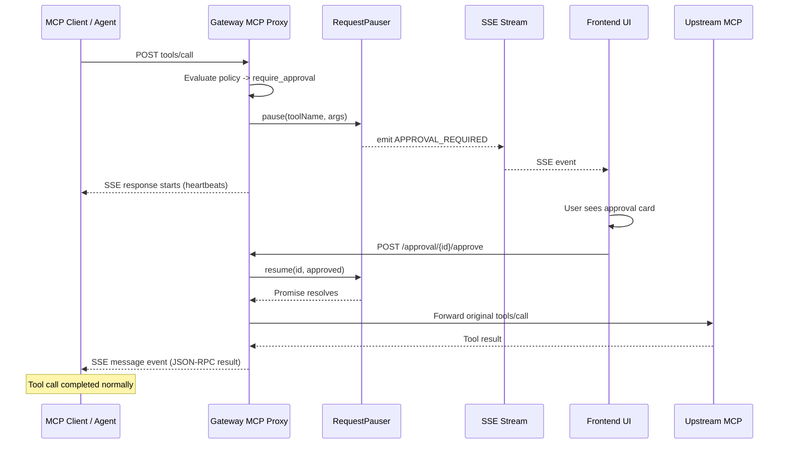

# Sync-Hold Approval for MCP Proxy

## Problem with Current Approach

The current flow returns `approval_required` immediately and expects the client to retry with `_approvalId` + `_approvalToken` injected into tool arguments. This is fragile:

- Pollutes tool argument schemas
- Requires LLMs to remember and correctly format retry fields
- Needs complex correlation/matching logic
- MCP clients can't easily inject custom fields

## New Strategy: Synchronous Hold (Cursor IDE Pattern)

Block the MCP `tools/call` HTTP response until the user approves or rejects. The agent never sees `approval_required` — from its perspective, the tool call just takes a while.




**Key benefit:** Works with ANY MCP client. No SDK wrapper, no retry, no tokens.

## Existing Infrastructure (no changes needed)

- **[src/services/pauser.service.ts](src/services/pauser.service.ts)**: `pause()` returns a Promise that resolves when `resume()` is called. Already has 5-min timeout with auto-reject, SSE event emission, and pre-created DB record support.
- **[src/routes/stream.ts](src/routes/stream.ts)**: SSE endpoint at `GET /v1/stream` already pushes `APPROVAL_REQUIRED` and `APPROVAL_RESOLVED` events to the frontend.
- **[src/routes/approval.ts](src/routes/approval.ts)**: Already calls `requestPauser.resume()` when user approves/rejects.

## Changes Required

### 1. `src/routes/mcp-proxy.ts` — Switch `require_approval` to sync hold with SSE

In the `require_approval` block (~line 280), replace the immediate `approval_required` JSON response with:

1. Create the DB approval record (keep existing code)
2. Return an SSE response via Hono's `streamSSE`
3. Inside the SSE stream:
  - Send heartbeat SSE comments (`: heartbeat\n\n`) every 15s to keep the connection alive
  - `await requestPauser.pause({...})` to block until resolved
  - On **approval**: forward original `tools/call` to upstream, get result, send as `event: message` SSE event containing the JSON-RPC response
  - On **rejection/timeout**: send `event: message` SSE event with a JSON-RPC result (text content saying the tool was rejected)

**Remove all token/retry correlation code:**

- Remove `_approvalId`/`_approvalToken` extraction from headers, `_meta`, and tool arguments (~lines 280-310)
- Remove `findApprovedByExactArgs` fallback block (~lines 340-370)
- Remove `validateApprovalToken`/`consumeApproval` calls (~lines 315-340)
- Remove the tool args stripping block (~lines 464-481) that cleaned `_approvalId`/`_approvalToken`/`_meta` from forwarded body

**Keep:** `APPROVAL_EXEMPT_TOOLS` set (still needed to prevent circular approvals)

### 2. `gateway-app/agent/main.py` — Simplify system prompt

Replace the "Tool Approval Flow" section (~lines 170-183) with a simple note:

- "Some tools may require human approval. When this happens, the tool call will wait automatically until the user approves or rejects. No retry or special handling needed."
- Remove all instructions about `_approvalId`, `_approvalToken`, retry patterns

### 3. `src/services/audit.service.ts` — Cleanup (optional)

The following methods are no longer called and can be removed or left as dead code:

- `findApprovedByExactArgs()` (~line 444)
- `validateApprovalToken()` (~line 572)
- `consumeApproval()` (~line 517)

The `approvalToken` / `tokenExpiresAt` DB columns can remain (harmless, no migration needed).

### 4. `src/routes/approval.ts` — Minor cleanup (optional)

Remove `approvalToken` from the approve response body (no longer needed by any client). Or leave it — harmless.

## SSE Response Detail

The MCP Python SDK (`StreamableHTTPTransport._handle_post_request`) already handles SSE responses from POST:

```python
content_type = response.headers.get("content-type", "").lower()
if content_type.startswith("text/event-stream"):
    await self._handle_sse_response(response, ctx, ...)
```

It iterates SSE events, parses `event: message` data as JSON-RPC, and considers the stream complete when it receives a `JSONRPCResponse` or `JSONRPCError`. Unknown events (or SSE comments) are silently handled.

For heartbeats, use SSE comments (`stream.write(': heartbeat\n\n')`) which are invisible to all SSE parsers.

## Upstream Response Handling

After approval, the gateway forwards to upstream. Two cases:

- **JSON response** (most common): Parse and wrap as SSE `event: message` with the JSON-RPC data
- **SSE response** (streaming tools): Read and forward each SSE event through to the client's SSE stream

## Timeout Behavior

- Default: 5 minutes (configurable via `requestPauser.pause({ timeout })`)
- On timeout: pauser auto-rejects with "Request timed out"
- Gateway sends rejection as SSE message event, stream closes
- Agent sees a normal tool response saying the tool timed out

