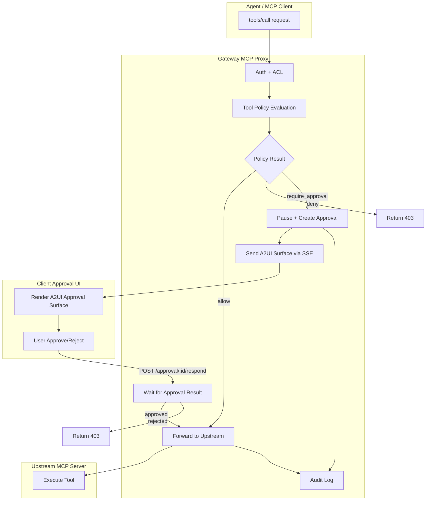

# Tool Policy and Approval Management System

## Current State

The gateway already has foundational pieces in place:

- **Policy service** ([src/services/policy.service.ts](src/services/policy.service.ts)): Config-based, global rules only (no DB, no per-provider/per-tool granularity)
- **MCP proxy** ([src/routes/mcp-proxy.ts](src/routes/mcp-proxy.ts)): Only enforces `deny`; `require_approval` is not wired up
- **Pauser service** ([src/services/pauser.service.ts](src/services/pauser.service.ts)): In-memory request pauser with DB approval records and SSE events -- fully functional but unused by MCP proxy
- **Approval routes** ([src/routes/approval.ts](src/routes/approval.ts)): Both in-memory and DB-based approve/reject endpoints -- functional
- **Provider access** ([src/services/provider-access.service.ts](src/services/provider-access.service.ts)): ACL for user/role -> provider (no group, no tool-level granularity)
- **Audit service** ([src/services/audit.service.ts](src/services/audit.service.ts)): Logs tool calls with approval fields (partially linked)

## Architecture




## Phase 1: DB-Backed Tool Policies

### 1.1 New DB Table: `tool_policies`

Add to [src/db/schema.ts](src/db/schema.ts) (both SQLite and PostgreSQL):

```typescript
// tool_policies - per-provider, per-tool policy rules
{
  id: text('id').primaryKey(),
  tenantId: text('tenant_id'),              // null = global
  providerId: text('provider_id').notNull(), // references tool_providers.id, or '*' for all
  toolPattern: text('tool_pattern').notNull(), // glob pattern: 'slack_send_message', 'github_*', '*'
  approvalMode: text('approval_mode')        // 'always' | 'never' | 'auto'
    .notNull()
    .default('auto'),
  allowedRoles: text('allowed_roles'),       // JSON array of role names that can execute
  approvalBypassRoles: text('approval_bypass_roles'), // JSON array: roles that skip approval
  riskLevel: text('risk_level').default('medium'),
  priority: integer('priority').default(0),  // higher = matched first
  description: text('description'),
  isActive: integer('is_active').default(true),
  createdBy: text('created_by'),             // user who created this policy
  createdAt: integer('created_at').notNull(),
  updatedAt: integer('updated_at'),
}
```

Key semantics:

- `approvalMode`:
  - `always`: Every call to matching tools requires human approval
  - `never`: No approval needed (auto-allow)
  - `auto`: Gateway decides based on risk level and context (falls back to config-based rules)
- `allowedRoles`: JSON array. If non-empty, only users with these roles can execute the tool. Empty/null = all roles allowed.
- `approvalBypassRoles`: JSON array. Users with these roles skip the approval flow even if `approvalMode` is `always`.

### 1.2 New Service: `tool-policy.service.ts`

Create [src/services/tool-policy.service.ts](src/services/tool-policy.service.ts):

- `evaluate(providerId, toolName, userRoles, tenantId)` -> `{ action, risk, matchedPolicy }`
- `create/update/delete/list/getById` CRUD
- Evaluation priority: exact tool match > glob match > provider wildcard > global wildcard
- Cache with TTL invalidation (like provider-access.service.ts)

### 1.3 Update DB Init

Add `tool_policies` table creation to [src/db/index.ts](src/db/index.ts) `initializeDatabase()`.

## Phase 2: MCP Proxy Approval Integration

### 2.1 Wire `require_approval` into MCP Proxy

In [src/routes/mcp-proxy.ts](src/routes/mcp-proxy.ts), replace the current policy check (lines 192-211) with the new flow:

```typescript
// Current: only handles 'deny'
// New: handles 'deny', 'require_approval', and 'allow'

const policyResult = toolPolicyService.evaluate({
  providerId: provider.id,
  toolName: toolCallName,
  userRoles: user.roles || [],
  tenantId: user.tenantId,
});

if (policyResult.action === 'deny') { /* 403 */ }

if (policyResult.action === 'require_approval') {
  // Check bypass list
  if (!policyResult.bypassApproval) {
    const approvalResult = await requestPauser.pause({
      userId: user.id,
      tenantId: user.tenantId,
      toolName: toolCallName,
      arguments: toolCallArgs,
      risk: policyResult.risk,
      providerId: provider.id,
      agentId: agent?.id,
      // A2UI surface definition for the approval UI
      a2uiSurface: buildApprovalA2UISurface(toolCallName, toolCallArgs, policyResult),
    });
    
    if (!approvalResult.approved) { /* 403 */ }
    // Continue to upstream with approval recorded
  }
}
```

### 2.2 Extend Pauser Service

Update [src/services/pauser.service.ts](src/services/pauser.service.ts):

- Add `providerId`, `agentId`, `a2uiSurface` fields to `pause()` input
- Include A2UI surface in the `approval_required` SSE event payload
- Enrich the SSE event with provider name, agent name for better context

### 2.3 Update Approvals DB Schema

Add columns to `approvals` table:

- `providerId` (text, nullable)
- `agentId` (text, nullable)
- `policyId` (text, nullable) -- which policy triggered this approval

## Phase 3: A2UI Approval UI Surface

### 3.1 Approval Surface Builder

Create [src/services/a2ui.service.ts](src/services/a2ui.service.ts):

Build A2UI JSONL surfaces for approval requests using the standard catalog:

```typescript
function buildApprovalA2UISurface(
  toolName: string,
  args: Record<string, unknown>,
  policy: PolicyEvaluationResult,
  options?: { customSurface?: A2UISurface }
): A2UISurface {
  // If MCP developer provided a custom approval surface, use it
  if (options?.customSurface) return options.customSurface;
  
  // Default approval surface:
  // Card with:
  //   - Header: "Approval Required" + risk badge
  //   - Tool name and provider
  //   - Arguments display (key-value)
  //   - Approve / Reject buttons
  return {
    surfaceId: `approval-${requestId}`,
    components: [
      { id: 'root', component: { Column: { children: { explicitList: ['header', 'details', 'actions'] } } } },
      { id: 'header', component: { Row: { children: { explicitList: ['title', 'risk_badge'] } } } },
      { id: 'title', component: { Text: { usageHint: 'h3', text: { literalString: 'Approval Required' } } } },
      { id: 'risk_badge', component: { Chip: { label: { literalString: policy.risk } } } },
      // ... details and action buttons
    ],
    dataModel: { toolName, arguments: args, risk: policy.risk },
  };
}
```

### 3.2 SSE Event Enhancement

Update [src/routes/stream.ts](src/routes/stream.ts):

- Include the A2UI surface in `APPROVAL_REQUIRED` events
- Client can render the surface using any A2UI renderer (React, Flutter, etc.)

### 3.3 Support Custom Approval UI from MCP Developers

Allow tool providers to register custom A2UI approval surfaces:

- Add optional `approvalUiSchema` field to `tool_policies` table (JSON text)
- When present, use it instead of the default approval surface

## Phase 4: Audit Log Enrichment

### 4.1 Enrich Existing Audit Flow

The MCP proxy already logs tool calls. Enhance to include:

- Link `approvalId` from the pauser to the audit log entry
- Record `approvedBy` (the user who approved)
- Record `policyId` (which policy triggered the approval)
- Store approval decision time (latency between request and approval)

Update [src/services/audit.service.ts](src/services/audit.service.ts) and the MCP proxy audit flow in [src/routes/mcp-proxy.ts](src/routes/mcp-proxy.ts).

## Phase 5: Admin API Routes

### 5.1 Tool Policy CRUD Routes

Create [src/routes/tool-policies.ts](src/routes/tool-policies.ts):


| Method | Path                               | Description                                        |
| ------ | ---------------------------------- | -------------------------------------------------- |
| GET    | `/v1/admin/tool-policies`          | List all policies (filterable by provider, tenant) |
| GET    | `/v1/admin/tool-policies/:id`      | Get single policy                                  |
| POST   | `/v1/admin/tool-policies`          | Create a new tool policy                           |
| PUT    | `/v1/admin/tool-policies/:id`      | Update a policy                                    |
| DELETE | `/v1/admin/tool-policies/:id`      | Delete a policy                                    |
| POST   | `/v1/admin/tool-policies/evaluate` | Test: evaluate a tool call against policies        |


Register in [src/index.ts](src/index.ts).

## Phase 6: Frontend Dashboard

### 6.1 Tool Policies Management Tab

Add to the gateway-app dashboard:

- **Policies Tab** in the main navigation (alongside Providers, Agents, API Keys, Approvals, Audit)
- **Policy List View**: table showing all policies with provider name, tool pattern, approval mode, risk level, allowed roles
- **Create/Edit Policy Form**: 
  - Select provider (dropdown from existing providers, or `*` for all)
  - Tool pattern (glob input with preview)
  - Approval mode radio (Always / Never / Auto)
  - Allowed roles (multi-select from existing roles)
  - Approval bypass roles (multi-select)
  - Risk level select (low / medium / high / critical)
  - Description textarea
- **Delete confirmation dialog**

Files to create/modify:

- `gateway-app/src/components/policies/` -- new component directory
- `gateway-app/src/components/tabs/policies-tab.tsx` -- new tab
- `gateway-app/src/components/forms/policy-form.tsx` -- create/edit form
- `gateway-app/src/hooks/use-policy-tools.tsx` -- CopilotKit tools for policy management
- `gateway-app/src/lib/gateway-proxy/path-map.ts` -- add policy routes

### 6.2 Enhanced Approval Tab

Update existing [gateway-app/src/components/approvals/](gateway-app/src/components/approvals/):

- Show A2UI-rendered approval UI (or fallback to structured card)
- Display provider and agent context
- Show which policy triggered the approval
- Real-time SSE updates for new approvals

### 6.3 Audit Tab Enhancement

Update existing [gateway-app/src/components/audit/](gateway-app/src/components/audit/):

- Add policy/approval columns to audit table
- Filter by approval status
- Link to approval details

## Implementation Order

The phases should be implemented in this order to ensure each layer builds on the previous:

1. Phase 1 (DB + Service) -- foundation
2. Phase 2 (MCP Proxy integration) -- core functionality
3. Phase 4 (Audit enrichment) -- observability
4. Phase 5 (Admin API) -- management
5. Phase 3 (A2UI) -- rich UI delivery
6. Phase 6 (Frontend) -- full-stack management UI

