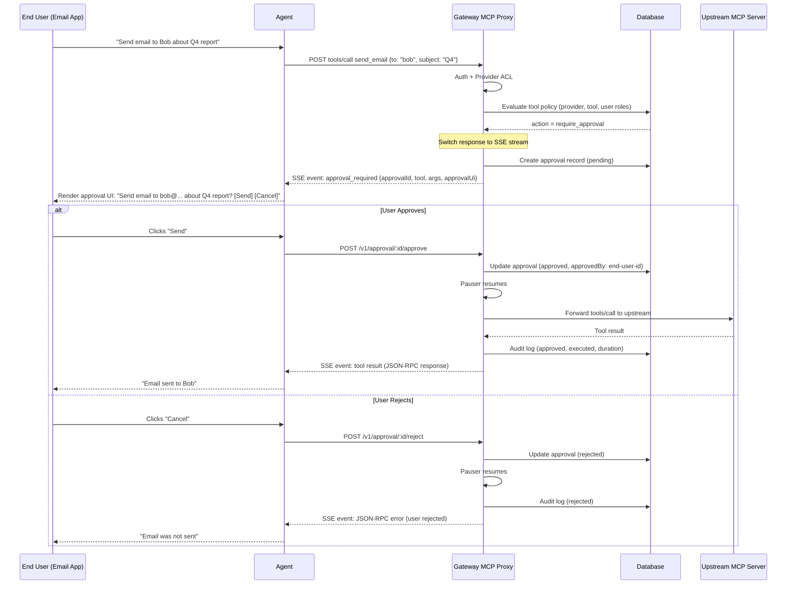

# Tool Policy and Approval Management System

## Key Design Decisions

1. **End user is the approver** -- the person using the agent's client application (email app, etc.), not the gateway admin.
2. **Sync hold with SSE** -- gateway holds the `tools/call` HTTP request, returns an SSE stream with `approval_required` event. End user's client app renders the approval UI. After user responds, gateway streams the tool result or rejection.
3. **Extend `provider_access_rules**` -- add tool-level policy columns to the existing ACL table. One unified system for access + approval governance.
4. **JSON schema approval UI** -- agent/MCP developers define structured JSON describing the approval UI. Client app renders with its own native components.

## Correct Approval Flow

The approval is for the **end user** of the client application, not the gateway admin. The gateway admin only defines **policies** (which tools need approval). The **approval UI** is defined by the agent/MCP developer and rendered in the end user's application.




## Phase 1: Extend Provider Access Rules with Tool Policies

### 1.1 Schema Changes

Extend `provider_access_rules` in [src/db/schema.ts](src/db/schema.ts) (SQLite + PostgreSQL).

**New columns on `provider_access_rules`:**

- `toolPattern` (text, default `'*'`) -- glob pattern scoping the rule to specific tools within the provider
- `approvalMode` (text, nullable: `'always'` | `'never'`) -- explicit override; null means derived from `action`
- `riskLevel` (text, nullable: `'low'` | `'medium'` | `'high'` | `'critical'`)
- `approvalUiSchema` (text, nullable) -- JSON: structured UI schema defined by agent/MCP developer for this tool/rule
- `description` (text, nullable)

**Extend `action` type:** `'allow'` | `'deny'` | `'require_approval'`

**New columns on `approvals` table:**

- `providerId` (text, nullable) -- which provider the tool belongs to
- `agentId` (text, nullable) -- which agent made the call
- `endUserId` (text, nullable) -- the end user who was asked to approve
- `ruleId` (text, nullable) -- which access rule triggered this approval

Examples of rules:

```
# All tools on "slack" provider require approval for role "agent_creator"
{ subjectType: "role", subjectId: "agent_creator", providerId: "slack-provider-id",
  toolPattern: "*", action: "require_approval", riskLevel: "medium" }

# But "slack_list_channels" is always allowed (no approval) for the same role
{ subjectType: "role", subjectId: "agent_creator", providerId: "slack-provider-id",
  toolPattern: "slack_list_channels", action: "allow" }

# Specific user can bypass approval on slack_send_message
{ subjectType: "user", subjectId: "trusted-user-id", providerId: "slack-provider-id",
  toolPattern: "slack_send_message", action: "allow" }
```

More specific rules override broader ones: exact tool > glob > wildcard, user > role.

### 1.2 Type Updates

Update [src/types/index.ts](src/types/index.ts):

```typescript
export type AccessAction = 'allow' | 'deny' | 'require_approval';

export interface ProviderAccessRule {
  // ... existing fields ...
  toolPattern?: string;                  // NEW: default '*'
  approvalMode?: 'always' | 'never' | null;  // NEW
  riskLevel?: RiskLevel | null;          // NEW
  approvalUiSchema?: ApprovalUiSchema | null; // NEW
  description?: string | null;           // NEW
}

// JSON schema for the approval UI (defined by agent/MCP developer)
export interface ApprovalUiSchema {
  title: string;                   // "Send Email Approval"
  description?: string;            // "The agent wants to send an email from your account"
  fields: ApprovalUiField[];       // Fields to display from tool arguments
  actions?: {
    approve?: { label: string };   // { label: "Send Email" }
    reject?: { label: string };    // { label: "Cancel" }
  };
  riskWarning?: string;            // "This will send an email from your account"
}

export interface ApprovalUiField {
  key: string;           // JSON path into tool arguments: "to", "subject", "body"
  label: string;         // Display label: "Recipient"
  type?: 'text' | 'multiline' | 'code' | 'json' | 'hidden';
  editable?: boolean;    // Can the user modify this value before approving?
}

// Result of tool-level policy evaluation
export interface ToolPolicyResult {
  action: AccessAction;
  risk: RiskLevel;
  matchedRule?: ProviderAccessRule;
  approvalUiSchema?: ApprovalUiSchema | null;
}
```

### 1.3 DB Init

Update [src/db/index.ts](src/db/index.ts) `initializeDatabase()`:

- Add new columns with `ALTER TABLE provider_access_rules ADD COLUMN ... IF NOT EXISTS`
- Add new columns to `approvals` table
- Default `toolPattern` to `'*'` for existing rows

### 1.4 Service Extension

Add to [src/services/provider-access.service.ts](src/services/provider-access.service.ts):

**New method: `evaluateToolPolicy()**`

```typescript
async evaluateToolPolicy(
  userId: string,
  roles: string[],
  providerId: string,
  toolName: string,
  tenantId?: string
): Promise<ToolPolicyResult>
```

Evaluation order (most specific wins):

1. Fetch all rules matching (userId/roles, providerId, tenant) -- same as existing `getRulesForAccess()` but also includes `toolPattern`
2. Score each rule by specificity:
  - Exact tool name match > glob pattern match > wildcard `*`
  - User-level > role-level
  - Deny > require_approval > allow (at same specificity)
3. Return the highest-specificity matching rule's action

This means a user-level `allow` on an exact tool name beats a role-level `require_approval` on `*` -- which is the natural "bypass" behavior.

If no tool-specific rules exist, fall back to the existing `checkAccess()` (provider-level) and then the config-based `policyService.evaluate()` for backwards compatibility.

## Phase 2: Sync Hold Approval Flow in MCP Proxy

### 2.1 MCP Proxy Changes

Replace the policy check in [src/routes/mcp-proxy.ts](src/routes/mcp-proxy.ts) (lines ~182-235). When `tools/call` is detected and policy says `require_approval`:

```typescript
if (policyResult.action === 'require_approval') {
  // Create approval record in DB
  const approvalRequestId = nanoid();
  await auditService.recordApproval({
    requestId: approvalRequestId,
    userId: user.id,
    tenantId: user.tenantId,
    toolName: toolCallName,
    arguments: toolCallArgs,
    risk: policyResult.risk,
    providerId: provider.id,
    agentId: agent?.id,
    endUserId: endUserId || user.id,
    ruleId: policyResult.matchedRule?.id,
  });

  // Build approval UI (from rule schema or generate default)
  const approvalUi = policyResult.approvalUiSchema
    || buildDefaultApprovalUi(toolCallName, toolCallArgs, policyResult.risk);

  // Switch to SSE response and hold
  return streamSSE(c, async (stream) => {
    // 1. Send approval_required event to the client
    await stream.writeSSE({
      event: 'approval_required',
      data: JSON.stringify({
        approvalId: approvalRequestId,
        toolName: toolCallName,
        arguments: toolCallArgs,
        risk: policyResult.risk,
        provider: { id: provider.id, name: provider.name },
        approvalUi,
        approvalEndpoint: `/api/v1/approval/${approvalRequestId}`,
      }),
    });

    // 2. Wait for approval using the pauser service
    const approvalResult = await requestPauser.pause({
      userId: user.id,
      tenantId: user.tenantId,
      endUserId: endUserId || user.id,
      toolName: toolCallName,
      arguments: toolCallArgs || {},
      risk: policyResult.risk,
      providerId: provider.id,
      agentId: agent?.id,
      approvalRequestId,  // link to DB record
    });

    if (!approvalResult.approved) {
      // 3a. Rejected -- send JSON-RPC error
      await stream.writeSSE({
        event: 'message',
        data: JSON.stringify({
          jsonrpc: '2.0',
          id: jsonRpcId,
          error: {
            code: -32001,
            message: approvalResult.reason || 'Tool call rejected by user',
            data: { approvalId: approvalRequestId, rejectedBy: approvalResult.approvedBy },
          },
        }),
      });
      return;
    }

    // 3b. Approved -- forward to upstream MCP
    const upstreamResponse = await fetch(upstreamUrl, {
      method: 'POST', headers: forwardHeaders, body,
    });
    const responseBody = await upstreamResponse.text();

    // 4. Stream the tool result back
    await stream.writeSSE({
      event: 'message',
      data: responseBody,  // The upstream JSON-RPC response
    });

    // 5. Audit log (fire-and-forget)
    auditService.log({
      userId: user.id,
      tenantId: user.tenantId,
      agentId: agent?.id,
      endUserId: endUserId || user.id,
      providerId: provider.id,
      toolName: toolCallName,
      arguments: toolCallArgs,
      result: JSON.parse(responseBody)?.result,
      approvalId: approvalRequestId,
      approvedBy: approvalResult.approvedBy,
      status: 'completed',
      duration: Date.now() - startTime,
    }).catch(() => {});
  });
}
```

### 2.2 Extend Pauser Service

Update [src/services/pauser.service.ts](src/services/pauser.service.ts):

- Add `providerId`, `agentId`, `endUserId`, `approvalRequestId` fields to `pause()` input and `PendingRequest`
- When `approvalRequestId` is provided, link to existing DB approval record instead of creating a new one
- Include richer context in SSE events (provider name, agent name, approval UI schema)

### 2.3 Approval Routes for End Users

Update [src/routes/approval.ts](src/routes/approval.ts):

- Use `flexibleAuthMiddleware` instead of `authMiddleware` so end users with API keys or agent runtime tokens can also approve
- Authorization check: the end user who is the target of the approval (`endUserId`) can respond, in addition to admins
- Add `GET /v1/approval/pending` -- list pending approvals for the current end user (for polling fallback)

### 2.4 Default Approval UI Builder

Add a helper function in [src/routes/mcp-proxy.ts](src/routes/mcp-proxy.ts) or a small utility:

```typescript
function buildDefaultApprovalUi(
  toolName: string,
  args: Record<string, unknown> | undefined,
  risk: RiskLevel
): ApprovalUiSchema {
  const fields: ApprovalUiField[] = Object.entries(args || {}).map(([key, value]) => ({
    key,
    label: key.replace(/_/g, ' ').replace(/\b\w/g, c => c.toUpperCase()),
    type: typeof value === 'string' && value.length > 100 ? 'multiline' : 'text',
  }));

  return {
    title: `Approve: ${toolName.replace(/_/g, ' ')}`,
    description: `The agent wants to execute "${toolName}". Please review and approve or reject.`,
    fields,
    actions: {
      approve: { label: 'Approve' },
      reject: { label: 'Reject' },
    },
    riskWarning: risk === 'critical' || risk === 'high'
      ? `This is a ${risk}-risk operation. Please review carefully.`
      : undefined,
  };
}
```

## Phase 3: Audit Log Enrichment

Update [src/services/audit.service.ts](src/services/audit.service.ts) and [src/routes/mcp-proxy.ts](src/routes/mcp-proxy.ts):

- **Approved tool calls**: Record `approvalId`, `approvedBy` (end user ID), `ruleId` in the audit log
- **Denied by policy**: Create a `failed` audit entry with reason `POLICY_DENIED`, including `ruleId`
- **Rejected by user**: Create a `rejected` audit entry with `approvalId`, `approvedBy` (rejector)
- **Allowed without approval**: Existing audit flow, add `ruleId` for traceability

Extend `recordApproval()` to accept the new fields (`providerId`, `agentId`, `endUserId`, `ruleId`).

## Phase 4: Admin API Routes

Extend existing provider access routes in [src/routes/provider-access.ts](src/routes/provider-access.ts):

- `POST /v1/admin/provider-access` -- extend input schema to accept `toolPattern`, `approvalMode`, `riskLevel`, `approvalUiSchema`, `description`
- `PUT /v1/admin/provider-access/:id` -- update with new fields
- `GET /v1/admin/provider-access` -- add filter params: `?toolPattern=...&action=require_approval&providerId=...`
- `POST /v1/admin/provider-access/evaluate` -- **new**: test a hypothetical (userId, providerId, toolName) against current rules, returns what action would be taken
- `GET /v1/admin/provider-access/by-provider/:providerId` -- **new**: list all rules for a specific provider, grouped by tool pattern

Register new routes in [src/index.ts](src/index.ts) if needed.

## Phase 5: Frontend Dashboard (Admin Side)

### 5.1 Policy Management UI

Add a "Policies" tab to the admin dashboard:

- **Rule List**: table with columns -- Provider, Tool Pattern, Subject (user/role), Action (allow/deny/require_approval), Risk Level, Description
- **Create/Edit Form**:
  - Provider dropdown (from existing providers, or `*`)
  - Tool pattern text input (with glob pattern examples)
  - Subject type (user / role) + subject selector
  - Action radio: Allow / Deny / Require Approval
  - Risk level (shown when action = require_approval)
  - Approval UI schema editor (JSON textarea, shown when action = require_approval)
  - Description
- **Policy Test**: enter (user, provider, tool) and see the evaluation result
- **Delete with confirmation**

Files to create/modify:

- `gateway-app/src/components/policies/policy-card.tsx`, `policy-list.tsx`, `index.ts`
- `gateway-app/src/components/tabs/policies-tab.tsx`
- `gateway-app/src/components/forms/policy-form.tsx`
- `gateway-app/src/hooks/use-policy-tools.tsx`
- `gateway-app/src/lib/gateway-proxy/path-map.ts` -- add routes

### 5.2 Enhanced Approval and Audit Tabs

- **Approvals tab**: show history of all approvals with provider, agent, end user, and which rule triggered them. This is for admin visibility into what end users have approved/rejected.
- **Audit tab**: add columns for approval status, rule ID, end user. Filter by approval-related entries.

## Implementation Order

1. **Phase 1** (Schema + Types + Service) -- DB foundation, backwards compatible
2. **Phase 2** (MCP Proxy sync hold + Pauser + Approval routes) -- core end-user approval flow
3. **Phase 3** (Audit enrichment) -- observability
4. **Phase 4** (Admin API) -- management endpoints
5. **Phase 5** (Frontend admin dashboard) -- policy management UI

## Future Enhancements

- **A2UI integration**: Replace JSON schema approval UI with A2UI surfaces for richer, cross-platform rendering
- **Editable approval fields**: Allow end users to modify tool arguments before approving (e.g., change email recipient)
- **Auto-approval rules**: Based on user history, risk score, or time-based policies
- **Multi-approver workflows**: Require N-of-M approvals for critical operations
- **Approval delegation**: Allow end users to delegate approval authority

