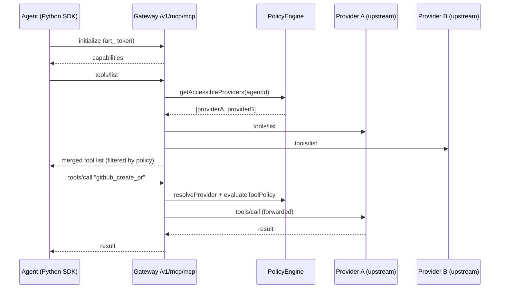

# Unified MCP Endpoint -- Agent-Level Policy and Tool Aggregation

## Architecture




## Step 1: Extend `subjectType` to support `'agent'`

The current `AccessSubjectType` in [src/types/index.ts](src/types/index.ts) is `'user' | 'role' | 'group'`. We need to add `'agent'`.

**Files to change:**

- [src/types/index.ts](src/types/index.ts) -- Change `AccessSubjectType` to `'user' | 'role' | 'group' | 'agent'`
- [src/db/schema.ts](src/db/schema.ts) -- Update `$type<>` on `subjectType` in both `providerAccessRulesSqlite` (line 148) and `providerAccessRulesPg` (line 316) to include `'agent'`
- [src/services/provider-access.service.ts](src/services/provider-access.service.ts) -- Two changes:
  - `getRulesForAccess()`: Add `agentId` parameter; include rules where `subjectType === 'agent' && subjectId === agentId` in the filter
  - `checkAccess()` and `evaluateToolPolicy()`: Add `agentId?: string` parameter, pass it through. In evaluation priority, agent-specific rules should be checked between user-level and role-level (user > agent > role > wildcard)

**Evaluation priority after change:**

```
1. User-level deny/allow (most specific)
2. Agent-level deny/allow
3. Role-level deny/allow
4. Wildcard deny/allow
5. Default: allow
```

## Step 2: New Unified MCP Endpoint

Create [src/routes/mcp-unified.ts](src/routes/mcp-unified.ts) -- a new route file that exposes:

```
POST   /v1/mcp/mcp     -- JSON-RPC (initialize, tools/list, tools/call, etc.)
GET    /v1/mcp/mcp     -- SSE session resumption
DELETE /v1/mcp/mcp     -- Session termination
```

Mount it in [src/index.ts](src/index.ts) alongside the existing proxy route:

```typescript
app.route('/v1/mcp', mcpUnifiedRoutes);   // NEW: unified
app.route('/v1/mcp-proxy', mcpProxyRoutes); // existing: per-provider
```

**Key logic in POST handler:**

- **Auth**: Reuse `flexibleAuthMiddleware`. The `art_` token identifies the agent; `c.get('agent')` gives the agent object.
- `**initialize`**: Return gateway capabilities (same as a standard MCP server).
- `**tools/list`**: Call new service method `getAggregatedTools(agentId, tenantId)` that:
  1. Gets all active providers for the tenant via `toolProviderService.getActiveProviders(tenantId)`
  2. For each provider, checks `providerAccessService.checkAccess(userId, roles, providerId, tenantId, agentId)` -- skip denied providers
  3. For each accessible provider, fetches `tools/list` from upstream (with TTL cache ~60s)
  4. For each tool, checks `evaluateToolPolicy()` -- filter out `deny` tools
  5. Returns merged list. On name collision, higher-priority provider wins.
- `**tools/call`**: 
  1. Use `toolProviderService.resolveProvider(tenantId, toolName)` to find the provider
  2. Check agent-level access via `checkAccess()` with `agentId`
  3. Evaluate tool policy via `evaluateToolPolicy()` with `agentId`
  4. Forward to upstream -- reuse the same policy enforcement, audit, and approval logic from [src/routes/mcp-proxy.ts](src/routes/mcp-proxy.ts)
- **Other methods** (`notifications/`*, `resources/`*, etc.): Route based on prior tool resolution or broadcast to all accessible providers.

**Code reuse strategy**: Extract the shared logic from `mcp-proxy.ts` (policy enforcement, audit logging, upstream forwarding, approval SSE hold) into helper functions in a new [src/services/mcp-proxy.service.ts](src/services/mcp-proxy.service.ts) so both the per-provider and unified endpoints can share it.

## Step 3: Tool Aggregation Service

Create [src/services/tool-aggregation.service.ts](src/services/tool-aggregation.service.ts):

```typescript
class ToolAggregationService {
  private toolListCache = new TTLCache<MergedToolList>(60_000);

  async getAggregatedTools(
    userId: string, roles: string[], tenantId?: string, agentId?: string
  ): Promise<McpTool[]> { ... }

  async resolveToolProvider(
    toolName: string, tenantId?: string
  ): Promise<ToolProvider | null> { ... }
}
```

- Caches aggregated tool lists per agent (key: `agentId:tenantId`)
- Fetches `tools/list` from each upstream provider using `fetch()` with provider auth headers
- Merges and deduplicates (provider priority wins on collision)
- Filters by agent policy

## Step 4: MCP Proxy Endpoint Adaptation

Update [src/routes/mcp-proxy.ts](src/routes/mcp-proxy.ts) to pass `agentId` into `checkAccess()` and `evaluateToolPolicy()`:

```typescript
// Line 87-92: Add agentId to checkAccess
const access = await providerAccessService.checkAccess(
  user.id, user.roles || [], provider.id, user.tenantId, agent?.id
);

// Line 265-271: Add agentId to evaluateToolPolicy
const policyResult = await providerAccessService.evaluateToolPolicy(
  endUserId, endUserRoles, provider.id, toolCallName!, endUserTenantId, agent?.id
);
```

This ensures agent-level policies also work with the existing per-provider endpoint.

## Step 5: Python SDK -- Unified Mode

Update [packages/simplaix-gateway-py/simplaix_gateway/mcp.py](packages/simplaix-gateway-py/simplaix_gateway/mcp.py):

- Make `provider_id` optional (default `None`)
- When `provider_id` is `None`, build URL as `{base}/api/v1/mcp/mcp` (unified endpoint)
- When `provider_id` is provided, keep the current URL `{base}/api/v1/mcp-proxy/{provider_id}/mcp`

Agent developer DX after this change:

```python
from simplaix_gateway.mcp import GatewayMCPTransport

# Unified mode -- one connection, all authorized tools
transport = GatewayMCPTransport()
agent = Agent(model=model, tools=[MCPClient(transport)])
```

## File Change Summary

- **Modify** [src/types/index.ts](src/types/index.ts) -- add `'agent'` to `AccessSubjectType`
- **Modify** [src/db/schema.ts](src/db/schema.ts) -- add `'agent'` to subjectType on both SQLite and PG schemas
- **Modify** [src/services/provider-access.service.ts](src/services/provider-access.service.ts) -- add `agentId` parameter to `checkAccess()`, `evaluateToolPolicy()`, `getRulesForAccess()`
- **Modify** [src/routes/mcp-proxy.ts](src/routes/mcp-proxy.ts) -- pass `agentId` to policy methods
- **Create** [src/services/mcp-proxy.service.ts](src/services/mcp-proxy.service.ts) -- extract shared proxy logic
- **Create** [src/services/tool-aggregation.service.ts](src/services/tool-aggregation.service.ts) -- tool list aggregation + caching
- **Create** [src/routes/mcp-unified.ts](src/routes/mcp-unified.ts) -- unified MCP endpoint
- **Modify** [src/index.ts](src/index.ts) -- mount the new unified route
- **Modify** [packages/simplaix-gateway-py/simplaix_gateway/mcp.py](packages/simplaix-gateway-py/simplaix_gateway/mcp.py) -- unified mode support

