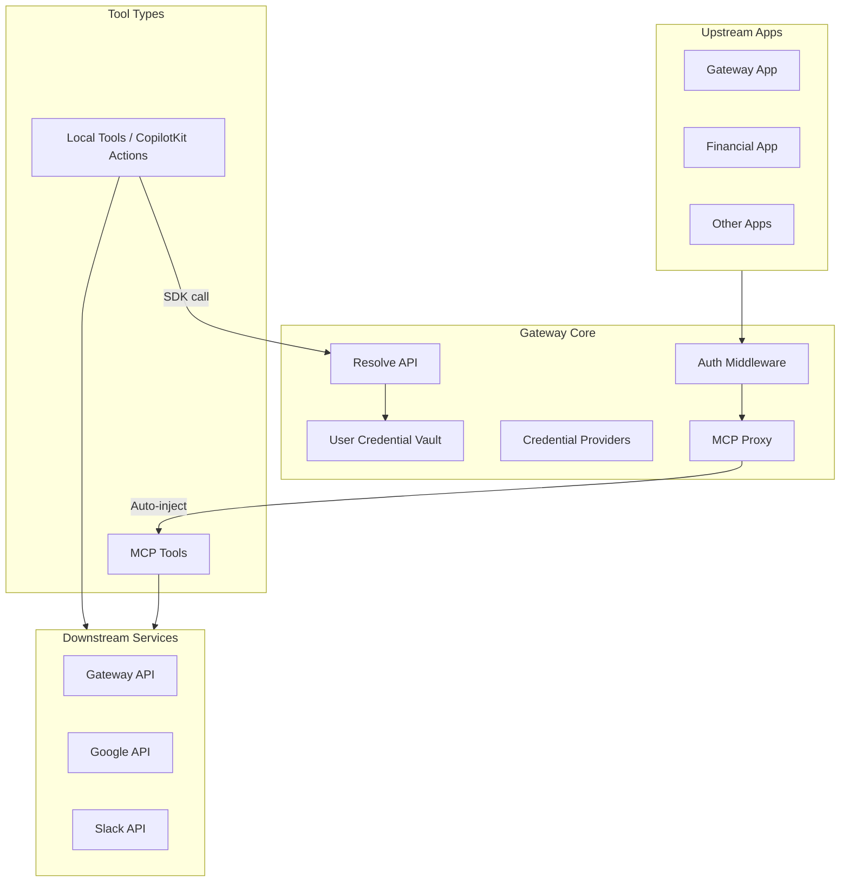
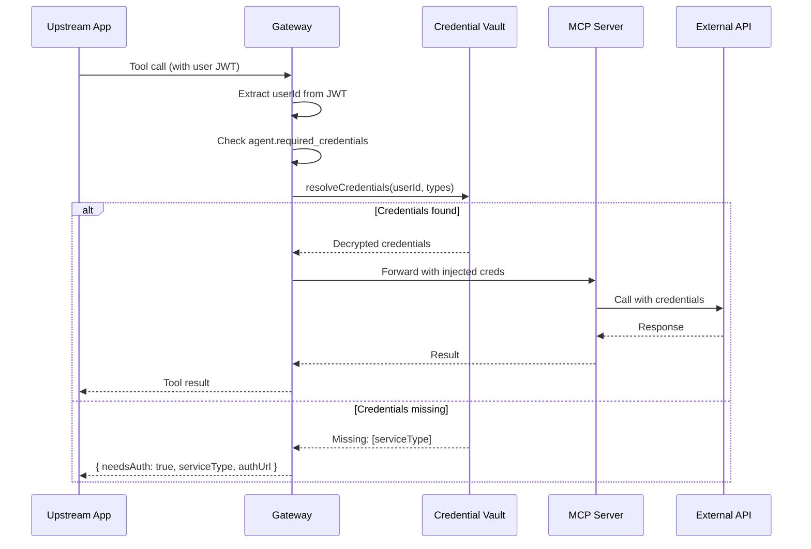
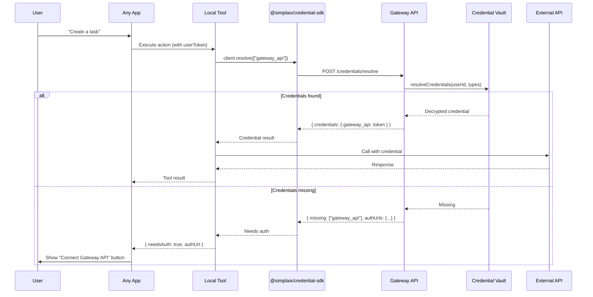

# User Credential System Implementation

## Architecture Overview

The system supports **two types of tools**:

1. **MCP Tools** - Credentials auto-injected at the Gateway proxy layer
2. **Local Tools** - CopilotKit actions that use an SDK to fetch credentials




## Database Schema Changes

Add two new tables to [src/db/schema.ts](src/db/schema.ts):

**1. `credential_providers` table** - Admin-configured credential types:

- `id`, `tenant_id`, `service_type` (unique identifier like `gateway_api`, `google`)
- `name`, `description`, `auth_type` (`oauth2`, `api_key`, `jwt`, `basic`)
- `config` (JSON: OAuth2 URLs, API key header names, etc.)
- `is_active`, `created_at`, `updated_at`

**2. `user_credentials` table** - Per-user stored credentials:

- `id`, `user_id`, `provider_id` (FK to credential_providers)
- `credentials` (encrypted JSON: tokens, API keys, etc.)
- `scopes` (granted OAuth scopes)
- `expires_at`, `refresh_token` (encrypted)
- `created_at`, `updated_at`

**3. Modify `agents` table** - Add `required_credentials` column:

- JSON array of `{ serviceType: string, scopes?: string[], description: string }`

## New Services

**1. [src/services/credential-provider.service.ts**](src/services/credential-provider.service.ts)

- CRUD for credential providers
- `getByServiceType(serviceType, tenantId)` - resolve provider config

**2. [src/services/credential.service.ts**](src/services/credential.service.ts)

- `getUserCredential(userId, serviceType)` - get decrypted credential
- `storeCredential(userId, providerId, credentials)` - encrypt and store
- `deleteCredential(credentialId)` - remove user credential
- `resolveCredentials(userId, serviceTypes[])` - batch resolve for MCP call
- `refreshToken(credentialId)` - refresh OAuth tokens if expired

**3. [src/services/encryption.service.ts**](src/services/encryption.service.ts)

- `encrypt(data)` / `decrypt(data)` using AES-256-GCM
- Key from `CREDENTIAL_ENCRYPTION_KEY` env var

## New API Routes

**1. [src/routes/credentials.ts**](src/routes/credentials.ts) - User credential management:

```
GET    /api/v1/credentials              - List my credentials
DELETE /api/v1/credentials/:id          - Delete a credential
POST   /api/v1/credentials/apikey       - Add API key credential
POST   /api/v1/credentials/jwt          - Add JWT credential (for Gateway API)
GET    /api/v1/credentials/oauth/:type/auth     - Get OAuth auth URL (placeholder)
GET    /api/v1/credentials/oauth/:type/callback - OAuth callback (placeholder)
POST   /api/v1/credentials/resolve      - Internal: resolve credentials for MCP
```

**2. [src/routes/credential-providers.ts**](src/routes/credential-providers.ts) - Admin management:

```
GET    /api/v1/credential-providers          - List providers
POST   /api/v1/credential-providers          - Create provider
PUT    /api/v1/credential-providers/:id      - Update provider
DELETE /api/v1/credential-providers/:id      - Delete provider
```

## MCP Proxy Integration (Auto-Injection for MCP Tools)

Modify [src/services/mcp-proxy.service.ts](src/services/mcp-proxy.service.ts):

1. Before calling upstream MCP, check agent's `required_credentials`
2. Call `credentialService.resolveCredentials(userId, requiredTypes)`
3. If credentials missing, return `{ needsAuth: true, serviceType, authUrl }`
4. If credentials present, inject into request headers/body based on provider config
5. Handle token refresh if OAuth token expired

## Credential SDK Package for Local Tools

For local tools (CopilotKit actions, etc.) making API calls, provide an SDK as a **separate distributable package**.

**Package Structure: `packages/credential-sdk/**`

```
packages/
└── credential-sdk/
    ├── package.json          # @simplaix/credential-sdk
    ├── tsconfig.json
    ├── src/
    │   ├── index.ts          # Main exports
    │   ├── client.ts         # CredentialClient class
    │   ├── types.ts          # Type definitions
    │   └── errors.ts         # Custom error classes
    └── README.md
```

**SDK Interface (`packages/credential-sdk/src/client.ts`)**:

```typescript
export interface CredentialClientOptions {
  gatewayUrl: string;
  userToken: string;
}

export interface CredentialResult {
  credentials: Record<string, string>;  // { serviceType: token }
  missing: string[];                     // Missing service types
  authUrls: Record<string, string>;      // Auth URLs for missing credentials
}

export class CredentialClient {
  constructor(options: CredentialClientOptions);

  // Get credentials for one or more services
  async resolve(serviceTypes: string[]): Promise<CredentialResult>;

  // Convenience method for single credential
  async getCredential(serviceType: string): Promise<string | null>;

  // Check if credential exists
  async hasCredential(serviceType: string): Promise<boolean>;

  // Get auth URL for a service (to show "Connect" button)
  async getAuthUrl(serviceType: string): Promise<string | null>;
}

// Factory function
export function createCredentialClient(
  gatewayUrl: string, 
  userToken: string
): CredentialClient;
```

**Usage in Any App (Gateway App, Financial App, etc.)**:

```typescript
// Install: pnpm add @simplaix/credential-sdk (or workspace reference)
import { createCredentialClient } from '@simplaix/credential-sdk';

const myAction = {
  name: 'create_task',
  handler: async ({ userToken, ...args }) => {
    const client = createCredentialClient(
      process.env.GATEWAY_URL!,
      userToken
    );
    
    // Get Gateway API credential
    const result = await client.resolve(['gateway_api']);
    
    if (result.missing.length > 0) {
      return { 
        needsAuth: true, 
        serviceType: 'gateway_api',
        authUrl: result.authUrls['gateway_api']
      };
    }
    
    // Use credential to call Gateway API
    const response = await fetch(`${process.env.GATEWAY_URL}/api/v1/tasks`, {
      headers: { 'Authorization': `Bearer ${result.credentials['gateway_api']}` }
    });
    
    return response.json();
  }
};
```

**Workspace Configuration** (update root `pnpm-workspace.yaml`):

```yaml
packages:
  - 'gateway-app'
  - 'packages/*'
```

## Credential Flow: MCP Tools (Auto-Injection)




## Credential Flow: Local Tools (SDK-Based)




## Gateway API Credential Provider Implementation

For the first implementation, create a "Gateway API" credential provider:

- `serviceType`: `gateway_api`
- `authType`: `jwt`
- Users can store their Gateway JWT token
- When MCP tools call Gateway APIs, the stored JWT is injected as `Authorization: Bearer <token>`

## Configuration

Add to [src/config.ts](src/config.ts):

- `CREDENTIAL_ENCRYPTION_KEY` - 32-byte hex key for AES-256-GCM
- `OAUTH_CALLBACK_BASE_URL` - Base URL for OAuth callbacks

## Key Files to Create/Modify

**Backend (Gateway Core):**

- `src/db/schema.ts` - Add `credential_providers`, `user_credentials` tables; add `required_credentials` to agents
- `src/services/encryption.service.ts` - Create AES-256-GCM encryption/decryption
- `src/services/credential-provider.service.ts` - Create credential provider CRUD
- `src/services/credential.service.ts` - Create user credential management
- `src/routes/credentials.ts` - Create user credential API endpoints
- `src/routes/credential-providers.ts` - Create admin credential provider endpoints
- `src/services/mcp-proxy.service.ts` - Modify to add credential resolution and injection for MCP tools
- `src/routes/admin.ts` - Modify to support `required_credentials` in agent registration
- `src/index.ts` - Modify to mount new routes
- `src/config.ts` - Modify to add encryption key config
- `src/types/index.ts` - Modify to add credential-related types

**Credential SDK Package (For Local Tools):**

- `packages/credential-sdk/package.json` - Package config (`@simplaix/credential-sdk`)
- `packages/credential-sdk/src/index.ts` - Main exports
- `packages/credential-sdk/src/client.ts` - CredentialClient class
- `packages/credential-sdk/src/types.ts` - Type definitions
- `packages/credential-sdk/src/errors.ts` - Custom error classes
- `pnpm-workspace.yaml` - Add `packages/*` to workspace

