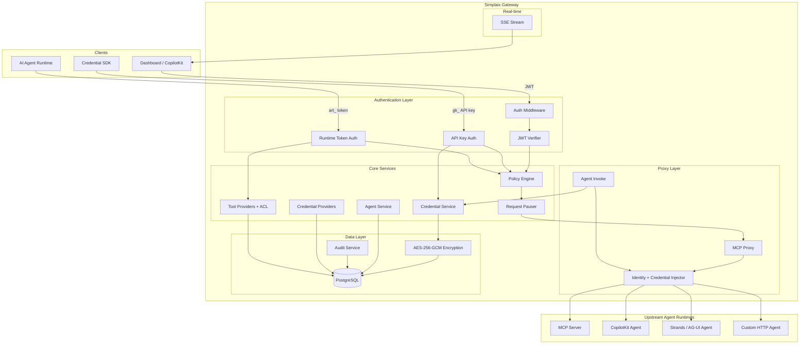

# Agent Gateway by Simplaix

An open-source Agent Gateway that gives your AI agents a secure foundation — identity, credentials, policy enforcement, and observability — so you can deploy agents to production with confidence.

## Why Simplaix Gateway?

AI agents are increasingly autonomous — they call APIs, access sensitive data, and take real-world actions on behalf of users. But most agent frameworks lack the infrastructure to do this safely:

- **Who is this agent?** No standard identity or authentication model.
- **What can it access?** No fine-grained access control for tools and APIs.
- **Where are the credentials?** Secrets are hardcoded or scattered across configs.
- **Did anyone approve this?** No human-in-the-loop for high-risk operations.
- **What happened?** No audit trail when things go wrong.

Simplaix Gateway sits between your agents and the outside world, solving all of these problems in one layer.

## Key Features

- **Agent Identity** — Register agents with runtime tokens, kill switches, and tenant isolation
- **Multi-Protocol Routing** — Route to any HTTP agent runtime: MCP servers, CopilotKit, Strands/AG-UI, or custom endpoints
- **MCP Proxy with ACL** — Provider-based tool routing with access control and policy enforcement
- **Credential Vault** — Encrypted per-user credential storage with automatic injection into agent requests
- **Policy Engine** — Allow, deny, or require human confirmation per tool, with risk-level classification
- **Human-in-the-Loop** — SSE-based real-time confirmation workflow for sensitive operations
- **Audit Trail** — Every tool call logged with agent ID, end-user ID, timing, and full context
- **Multi-Tenancy** — Tenant isolation across agents, credentials, users, and policies

## Architecture



## Quick Start

### Prerequisites

- Node.js 20+
- pnpm
- PostgreSQL 17+ (or Docker)
- Python 3.12+ (for the agent)

### 1. Clone and install

```bash
git clone https://github.com/simplaix/simplaix-gateway.git
cd simplaix-gateway
pnpm install
```

### 2. Configure environment

```bash
cp .env.example .env
# Edit .env — at minimum, set a JWT_SECRET and ADMIN_PASSWORD
```

### 3. Start PostgreSQL

```bash
docker compose up -d postgres
```

### 4. Apply migrations and start

```bash
pnpm db:migrate
pnpm dev
```

The Gateway will be running at `http://localhost:3001`. Verify with:

```bash
curl http://localhost:3001/api/health
```

### 5. Start the dashboard (optional)

```bash
# In a new terminal
pnpm --filter simplaix-gateway-app dev:ui
```

### 6. Start the Python agent (optional)

```bash
# In a new terminal
cd gateway-app/agent && uv sync && uv run main.py
```

## Project Structure

```
simplaix-gateway/
  src/                          # Gateway API (Hono on Vercel)
    routes/                     # Route modules
    services/                   # Domain services
    middleware/                  # Auth, policy, audit middleware
    db/                         # Drizzle schema + migrations
  gateway-app/                  # Next.js dashboard + Python agent
  docs/                         # Documentation site (Fumadocs)
  packages/
    simplaix-gateway-py/        # Python credential SDK
    lobster-shell/              # Shell integration package
```

## Documentation

Full documentation is available in the `docs/` directory. To run locally:

```bash
pnpm --filter docs dev
```

## Contributing

Contributions are welcome! Please open an issue or submit a pull request.

## License

[Apache 2.0](LICENSE)
