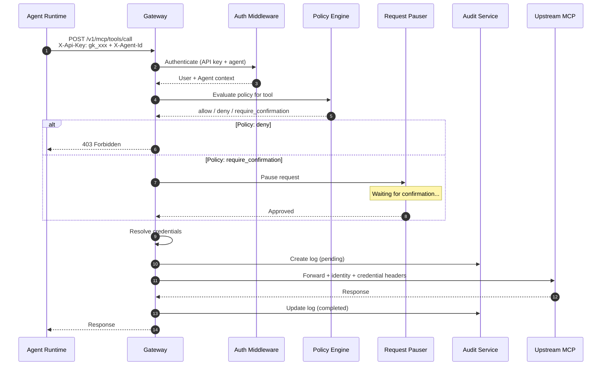

In addition to the protocol-agnostic [agent invoke endpoint](/docs/api-reference/agents#invoke-agent), the Gateway provides a dedicated MCP proxy for JSON-RPC tool calls. This proxy routes tool calls from agent runtimes to upstream MCP servers with policy enforcement, confirmation workflows, and credential injection. All proxy endpoints use API key authentication.

## Request Flow



## Call a Tool

```bash
POST /api/v1/mcp/tools/call
X-Api-Key: gk_xxx
X-Agent-Id: <agent-id>
X-User-Id: <user-id>
Content-Type: application/json

{
  "name": "get_balance",
  "arguments": { "account_id": "user123" }
}
```

The Gateway will:
1. Authenticate the API key and resolve the agent
2. Evaluate the policy engine for the tool name
3. Resolve and inject credentials
4. Forward the request to the agent's upstream server
5. Return the upstream response

## List Tools

```bash
GET /api/v1/mcp/tools/list
X-Api-Key: gk_xxx
X-Agent-Id: <agent-id>
```

## Read a Resource

```bash
POST /api/v1/mcp/resources/read
X-Api-Key: gk_xxx
X-Agent-Id: <agent-id>
X-User-Id: <user-id>
Content-Type: application/json

{
  "uri": "resource://example"
}
```

## List Resources

```bash
GET /api/v1/mcp/resources/list
X-Api-Key: gk_xxx
X-Agent-Id: <agent-id>
```
