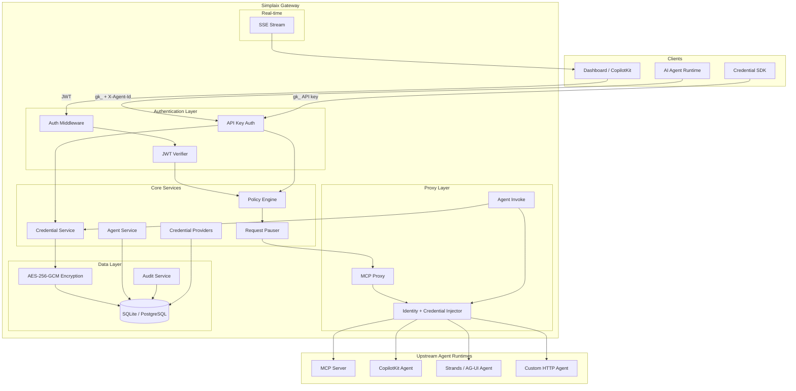

The Simplaix Gateway sits between client applications and upstream agent runtimes, providing a unified security, identity, and credential management layer. It is protocol-agnostic -- the same Gateway can route to MCP servers, CopilotKit agents, Strands/AG-UI agents, or any custom HTTP service.

## Architecture Diagram

## Layers

### Authentication Layer

The Gateway supports two authentication methods:

- **JWT** -- for admin operations and agent invocation from frontends
- **API Keys (`gk_`)** -- for server-to-server communication between agent runtimes and the Gateway

See [Authentication](/docs/authentication) for details.

### Core Services

- **Policy Engine** -- evaluates rules to allow, deny, or require confirmation for tool calls
- **Request Pauser** -- holds requests pending human confirmation decisions
- **Agent Service** -- manages agent registration, configuration, and lifecycle
- **Credential Service** -- encrypted credential storage and runtime resolution
- **Credential Providers** -- defines how each credential type (OAuth2, API key, JWT, basic) works

### Proxy Layer

- **MCP Proxy** -- routes MCP JSON-RPC tool calls to upstream servers with policy enforcement
- **Agent Invoke** -- protocol-agnostic agent invocation with credential pre-checking (supports JSON and SSE streaming responses)
- **Header Injector** -- injects user identity and resolved credentials into upstream requests

### Data Layer

- **Audit Service** -- logs every tool call with full context and timing
- **AES-256-GCM Encryption** -- encrypts all credentials at rest
- **SQLite / PostgreSQL** -- pluggable database backend via Drizzle ORM

### Real-time

- **SSE Stream** -- server-sent events for real-time confirmation notifications
