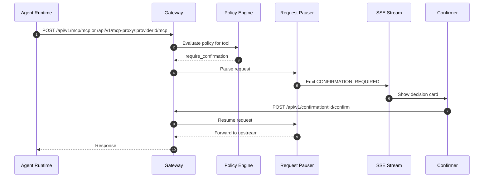

When the policy engine determines that a tool call requires human confirmation, the Gateway pauses the request and notifies confirmers via Server-Sent Events (SSE).

## Confirmation Flow



## How It Works

1. A tool call arrives on MCP proxy/unified MCP (or tool-gate) and matches `require_confirmation`
2. The Gateway creates a confirmation record with status `pending`
3. The request is paused using the Request Pauser service
4. A `CONFIRMATION_REQUIRED` event is emitted on the SSE stream
5. A confirmer (the end-user or an admin in the same tenant) sees the confirmation card in the dashboard
6. The confirmer confirms or rejects the request
7. If confirmed, the paused request is resumed and forwarded to the upstream server
8. If rejected, the request is denied with an appropriate response

## Confirmation States

| Status | Description |
|--------|-------------|
| `pending` | Awaiting human decision |
| `confirmed` | Confirmed by a human, request will proceed |
| `rejected` | Rejected by a human, or timed out with reason `Request timed out` |

## SSE Stream

Connect to the SSE stream to receive real-time confirmation notifications:

```bash
GET /api/v1/stream
```

The stream emits events including `CONFIRMATION_REQUIRED` with the confirmation details (tool name, arguments, risk level).

## Responding to Confirmations

```bash
# Confirm a request
POST /api/v1/confirmation/:id/confirm

# Reject a request
POST /api/v1/confirmation/:id/reject

# Respond with details
POST /api/v1/confirmation/:id/respond
{ "confirmed": true, "reason": "Looks good" }
```

See [Confirmation API Reference](/docs/api-reference/confirmations) for full endpoint details.
