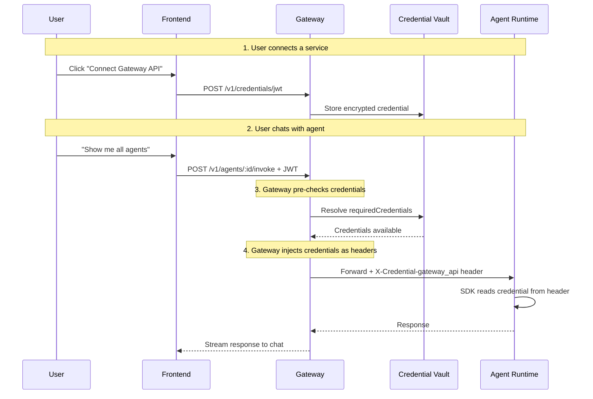

The Gateway provides an encrypted credential vault that stores per-user credentials (OAuth tokens, API keys, JWTs) and makes them available to agents at runtime.

## How It Works



## Credential Providers

Admins configure credential providers that define how each credential type works:

```bash
POST /api/v1/credential-providers
{
  "name": "Gateway API",
  "serviceType": "gateway_api",
  "authType": "jwt",
  "config": {
    "connectUrl": "/auth/connect?service=gateway_api",
    "jwt": { "headerName": "Authorization", "prefix": "Bearer " }
  }
}
```

### Supported Auth Types

| Auth Type | Description |
|-----------|-------------|
| `oauth2` | OAuth 2.0 flow with refresh tokens |
| `api_key` | Static API key |
| `jwt` | JSON Web Token |
| `basic` | Basic authentication (username/password) |

## Credential Resolution

Agents declare `requiredCredentials` in their configuration. The Gateway resolves these before forwarding requests:

- **Agent invoke route** (`/v1/agents/:id/invoke`): Pre-checks credentials. Returns `CREDENTIALS_REQUIRED` if missing, or injects `X-Credential-*` headers if available.
- **MCP proxy** (`/v1/mcp/tools/call`): Same pattern -- resolves and injects credentials into upstream headers.

## Encryption

All credentials are encrypted at rest using **AES-256-GCM**. The encryption key is configured via the `CREDENTIAL_ENCRYPTION_KEY` environment variable (a 64-character hex string).
